# Day 5: VPC Networking & Firewalls

**Duration:** ⏱️ 60 Minutes  
**Level:** Intermediate  
**ACE Exam Weight:** ⭐⭐⭐⭐⭐ Critical (Networking is the backbone of GCP)

---

## 🎯 Learning Objectives

By the end of Day 5, you will be able to:

*   **Define** Virtual Private Cloud (VPC) and its global nature
*   **Understand** Subnets, IP addressing, and CIDR notation
*   **Create** Firewall Rules to control ingress and egress traffic
*   **Differentiate** between Internal, External, and Private Google Access IPs
*   **Design** VPC peering and Shared VPC architectures

---

## 🧠 1. What Is a VPC? (Plain-English)

**VPC (Virtual Private Cloud) = Your private network inside Google Cloud.**

It isolates your resources from other customers and provides the foundation for all networking. 

> [!NOTE]
> **GCP Differentiator:** Unlike AWS or Azure where VPCs are regional, **GCP VPCs are Global**. You can have a single network spanning the entire planet without complex peering.

### 💡 Real-World Analogy: Office Building

| VPC Concept | Office Building Analogy |
|------------|------------------------|
| **VPC** | The entire building |
| **Subnet** | Individual floors (one per city/region) |
| **Firewall** | Security guards at entrances |
| **Routes** | Hallway signs directing traffic |
| **VM** | An office on a specific floor |

### Key VPC Facts for the Exam

| Feature | Value |
|---------|-------|
| **VPC Scope** | **GLOBAL** (spans all regions) |
| **Subnet Scope** | **REGIONAL** (tied to one region) |
| **Firewall Rules** | **GLOBAL** (apply across VPC) |
| **Default VPC** | Created automatically (can be deleted) |

---

## 🏗️ 2. VPC Architecture Deep Dive

### VPC Components

```mermaid
graph TD
    subgraph VPC["VPC Network (Global)"]
        subgraph US["us-central1 (Region)"]
            SUB1[Subnet: 10.0.1.0/24]
            VM1[🖥️ VM-1]
            VM2[🖥️ VM-2]
        end
        
        subgraph EU["europe-west1 (Region)"]
            SUB2[Subnet: 10.0.2.0/24]
            VM3[🖥️ VM-3]
        end
        
        subgraph ASIA["asia-south1 (Region)"]
            SUB3[Subnet: 10.0.3.0/24]
            VM4[🖥️ VM-4]
        end
        
        FW[🛡️ Firewall Rules]
        RT[🗺️ Routes]
    end
    
    INET[🌐 Internet] --> FW
    FW --> SUB1 & SUB2 & SUB3
    SUB1 --> VM1 & VM2
    SUB2 --> VM3
    SUB3 --> VM4
    
    style VPC fill:#e8f5e9,stroke:#4caf50,stroke-width:2px
    style FW fill:#ffebee,stroke:#f44336,stroke-width:2px
```



### Subnet Modes

| Mode | Description | Use Case |
|------|-------------|----------|
| **Auto Mode** | Google creates subnets in all regions automatically | Quick start, dev/test |
| **Custom Mode** | You create subnets only where needed | Production, compliance |

> **🎯 ACE Tip:** Production environments should use **Custom Mode** for better control and security.

---

## 🔢 3. IP Addressing & CIDR Notation

### CIDR Basics

| CIDR | Available IPs | Example Use |
|------|--------------|-------------|
| `/24` | 256 (254 usable) | Small subnet |
| `/20` | 4,096 (4,094 usable) | Medium workload |
| `/16` | 65,536 IPs | Large enterprise |
| `/8` | 16 million IPs | Massive scale |

### IP Types in GCP


### Reserved IP Ranges
*   `10.0.0.0/8` - RFC 1918 Private
*   `172.16.0.0/12` - RFC 1918 Private  
*   `192.168.0.0/16` - RFC 1918 Private
*   `0.0.0.0/0` - "The entire internet"

---

## 🛡️ 4. Firewall Rules (The Security Guards)

### Default Behavior
*   ✅ **Egress (outbound):** ALLOWED by default
*   ❌ **Ingress (inbound):** BLOCKED by default

### Firewall Rule Components

| Component | Description | ACE Exam Trap |
|-----------|-------------|---------------|
| **Direction** | Ingress (in) or Egress (out) | Default Egress is ALLOW, Ingress is DENY. |
| **Priority** | 0-65535 (lower = higher priority) | **Shadowing:** A rule with priority 1000 will "hide" a rule with priority 2000. |
| **Action** | Allow or Deny | Always use "Deny" for blocking specific bad actors. |
| **Target** | All instances, tags, or service accounts | **Tags** are best for dynamic environments. |

### 🛠️ Pro-Tip: The "Shadowing" Trap
If you have:
1.  **Rule A:** Priority 100, DENY port 80 (Target: all)
2.  **Rule B:** Priority 500, ALLOW port 80 (Target: tag 'web')

**Result:** Traffic to the 'web' tag on port 80 will be **DENIED**. The lower number (100) wins, regardless of the tag.

### 🕸️ Essential Networking Add-ons
| Service | Purpose | Exam Keyword |
|---------|---------|--------------|
| **Cloud NAT** | Allows private VMs (no external IP) to download updates from the internet. | "Outbound only", "No public IP" |
| **VPC Flow Logs** | Records network traffic for a subnet. | "Troubleshooting", "Audit", "Connectivity checks" |
| **Cloud Router** | Handles BGP for hybrid connections. | "Dynamic routing", "Enterprise connectivity" |

---

## 🛠️ 5. Hands-On Lab: Build a Secure VPC

### Step 1: Create Custom VPC
```bash
# Create VPC with custom mode
gcloud compute networks create my-secure-vpc \
    --subnet-mode=custom \
    --bgp-routing-mode=regional

# Create subnet
gcloud compute networks subnets create web-subnet \
    --network=my-secure-vpc \
    --region=us-central1 \
    --range=10.0.1.0/24 \
    --enable-private-ip-google-access
```

### Step 2: Create Firewall Rules
```bash
# Allow HTTP from internet
gcloud compute firewall-rules create allow-http \
    --network=my-secure-vpc \
    --direction=INGRESS \
    --priority=1000 \
    --action=ALLOW \
    --rules=tcp:80 \
    --source-ranges=0.0.0.0/0 \
    --target-tags=web-server

# Allow SSH from IAP only (secure!)
gcloud compute firewall-rules create allow-ssh-iap \
    --network=my-secure-vpc \
    --direction=INGRESS \
    --priority=1000 \
    --action=ALLOW \
    --rules=tcp:22 \
    --source-ranges=35.235.240.0/20 \
    --target-tags=allow-ssh

# Allow internal communication
gcloud compute firewall-rules create allow-internal \
    --network=my-secure-vpc \
    --direction=INGRESS \
    --priority=1000 \
    --action=ALLOW \
    --rules=all \
    --source-ranges=10.0.0.0/8
```

### Step 3: Create a VM
```bash
gcloud compute instances create web-vm \
    --zone=us-central1-a \
    --machine-type=e2-micro \
    --subnet=web-subnet \
    --tags=web-server,allow-ssh \
    --no-address  # No external IP (use IAP)
```

### Step 4: Connect via IAP
```bash
gcloud compute ssh web-vm --zone=us-central1-a --tunnel-through-iap
```

---

## 🔗 6. VPC Connectivity Options

### VPC Peering vs Shared VPC


| Feature | VPC Peering | Shared VPC |
|---------|-------------|------------|
| **Relationship** | Peer-to-peer | Host-Service |
| **Admin** | Each VPC managed separately | Central network admin |
| **Use Case** | Connect different orgs | Single org, multiple projects |
| **Transitive** | ❌ Not transitive | ✅ Centralized |

---

## ⚠️ 7. Exam Traps & Pro Tips

### ❌ Common Mistakes
| Mistake | Reality |
|---------|---------|
| "VPCs are regional" | No! VPCs are **global** |
| "Firewall rules are per-subnet" | No! Firewall rules are **per-VPC** |
| "0.0.0.0/0 means localhost" | No! It means **the entire internet** |

### ✅ Pro Tips
*   **Never use 0.0.0.0/0 for SSH** - Use IAP or specific IPs
*   **Enable Private Google Access** on subnets for VMs without external IPs
*   **Use tags** to target firewall rules instead of IP ranges
*   **Custom mode VPCs** for production environments

---

<!-- QUIZ_START -->
## 📝 8. Knowledge Check Quiz

1. **A VPC in Google Cloud is:**
    *   A. Regional
    *   B. **Global** ✅
    *   C. Zonal
    *   D. Project-specific only

2. **A Subnet in Google Cloud is:**
    *   A. Global
    *   B. **Regional** ✅
    *   C. Zonal
    *   D. Cross-project

3. **By default, what is the behavior of Ingress (Incoming) traffic?**
    *   A. Allowed
    *   B. **Blocked** ✅
    *   C. Allowed only from Google
    *   D. Allowed only from same project

4. **Which CIDR notation represents "The entire internet" in IP ranges?**
    *   A. 127.0.0.1
    *   B. **0.0.0.0/0** ✅
    *   C. 192.168.1.1
    *   D. 10.0.0.0/8

5. **Which port do you need to open for a secure HTTPS web server?**
    *   A. 80
    *   B. 22
    *   C. **443** ✅
    *   D. 3389
<!-- QUIZ_END -->

---

## ✅ Day 5 Checklist

- [ ] Understand VPC is Global, Subnets are Regional
- [ ] Create a custom VPC with proper CIDR
- [ ] Configure secure firewall rules (no 0.0.0.0/0 for SSH!)
- [ ] Enable Private Google Access
- [ ] Complete the hands-on lab

---

### 🚀 What's Next?
**Day 6: IAM & Identity Security**
*   Principals, Roles, and Policies
*   Service Accounts best practices
*   Least Privilege principle

<!-- FLASHCARDS
[
  {"term": "VPC", "def": "Virtual Private Cloud. Global network that spans all regions. Isolates your resources."},
  {"term": "Subnet", "def": "Regional resource within a VPC. Defines IP range for resources in that region."},
  {"term": "Firewall Rule", "def": "Controls traffic in/out of VPC. Ingress blocked by default, egress allowed."},
  {"term": "CIDR", "def": "Classless Inter-Domain Routing. Notation like /24 defines IP range size."},
  {"term": "Private Google Access", "def": "Allows VMs without external IPs to reach Google APIs privately."},
  {"term": "0.0.0.0/0", "def": "CIDR for 'the entire internet'. Use with caution in firewall rules."},
  {"term": "IAP", "def": "Identity-Aware Proxy. Secure alternative to opening SSH to the internet."}
]
-->
