# Day 5: VPC Networking & Firewalls

**Duration:** ⏱️ 60 Minutes  
**Level:** Intermediate  
**ACE Exam Weight:** ⭐⭐⭐⭐⭐ Critical (Networking is the backbone of GCP)

---

> [!TIP]
> **TL;DR (Key Takeaways)**  
> VPCs in GCP are **GLOBAL** (unlike AWS/Azure). Subnets are **REGIONAL**. Firewall rules are **per-VPC**. By default: outbound traffic is ALLOWED, inbound traffic is BLOCKED. Use **Cloud NAT** for private VMs to reach the internet. Never open SSH (port 22) to `0.0.0.0/0` — use **IAP** instead.

---

## 🎯 Learning Objectives

| ✅ Skill | Why It Matters |
|---------|----------------|
| **Define** VPC and its global nature | Core networking concept, unique to GCP |
| **Understand** Subnets and CIDR | Design proper IP address ranges |
| **Create** Firewall Rules | Control what traffic gets in/out |
| **Differentiate** IP types | Know when to use internal vs external |
| **Design** VPC peering vs Shared VPC | Connect multiple projects securely |

---

## 🏢 Industry Context: Networking in Real Companies

> [!NOTE]
> **Role Lens:** VPC networking is where most interview failures happen. Master this section thoroughly.

### Job Roles & VPC Usage

| Role | How They Use VPC | Day-to-Day Tasks |
|------|------------------|------------------|
| **Cloud Engineer** | Design subnets, firewall rules | Creating VPCs, troubleshooting connectivity |
| **Network Engineer** | Hybrid connectivity, routing | VPN, Interconnect, peering setup |
| **Security Engineer** | Firewall audits, network policies | Private Google Access, VPC Service Controls |
| **SRE** | Load balancer health, latency | Debugging "VM can't reach X" issues |
| **Solutions Architect** | Multi-region design | Hub-spoke patterns, Shared VPC |

### Production Networking Patterns

| Pattern | Architecture | When to Use |
|---------|--------------|-------------|
| **Shared VPC** | Host project → Service projects | Large organizations, central network control |
| **Hub-and-Spoke** | Central VPC peered to workload VPCs | Multi-team, many projects |
| **Private-Only** | No external IPs + Cloud NAT | Security-first production |
| **Multi-Region Active-Active** | Global LB → Regional MIGs | High availability apps |

### ❌ Mistakes That Fail Interviews

| Mistake | Why It's Bad | What to Say Instead |
|---------|--------------|---------------------|
| "I open port 22 to 0.0.0.0/0 for SSH" | Security disaster | "I use IAP tunneling, source range 35.235.240.0/20" |
| "VPCs are regional like AWS" | Shows you don't know GCP | "GCP VPCs are global, subnets are regional" |
| "I give VMs external IPs" | Unnecessary attack surface | "I use Cloud NAT for outbound-only internet access" |

---

## 🧠 1. What Is a VPC? (Plain-English)

**VPC (Virtual Private Cloud) = Your private network inside Google Cloud.**

It isolates your resources from other customers and provides the foundation for all networking. 

> [!NOTE]
> **GCP Differentiator:** Unlike AWS or Azure where VPCs are regional, **GCP VPCs are Global**. You can have a single network spanning the entire planet without complex peering.

### 💡 Real-World Analogy: Office Building

| VPC Concept | Office Building Analogy |
|------------|------------------------|
| **VPC** | The entire building |
| **Subnet** | Individual floors (one per city/region) |
| **Firewall** | Security guards at entrances |
| **Routes** | Hallway signs directing traffic |
| **VM** | An office on a specific floor |

### Key VPC Facts for the Exam

| Feature | Value |
|---------|-------|
| **VPC Scope** | **GLOBAL** (spans all regions) |
| **Subnet Scope** | **REGIONAL** (tied to one region) |
| **Firewall Rules** | **GLOBAL** (apply across VPC) |
| **Default VPC** | Created automatically (can be deleted) |

---

## 🏗️ 2. VPC Architecture Deep Dive

### VPC Components

```mermaid
graph TD
    subgraph VPC["VPC Network (Global)"]
        subgraph US["us-central1 (Region)"]
            SUB1[Subnet: 10.0.1.0/24]
            VM1[🖥️ VM-1]
            VM2[🖥️ VM-2]
        end
        
        subgraph EU["europe-west1 (Region)"]
            SUB2[Subnet: 10.0.2.0/24]
            VM3[🖥️ VM-3]
        end
        
        subgraph ASIA["asia-south1 (Region)"]
            SUB3[Subnet: 10.0.3.0/24]
            VM4[🖥️ VM-4]
        end
        
        FW[🛡️ Firewall Rules]
        RT[🗺️ Routes]
    end
    
    INET[🌐 Internet] --> FW
    FW --> SUB1 & SUB2 & SUB3
    SUB1 --> VM1 & VM2
    SUB2 --> VM3
    SUB3 --> VM4
    
    style VPC fill:#e8f5e9,stroke:#4caf50,stroke-width:2px
    style FW fill:#ffebee,stroke:#f44336,stroke-width:2px
```



### Subnet Modes

| Mode | Description | Use Case |
|------|-------------|----------|
| **Auto Mode** | Google creates subnets in all regions automatically | Quick start, dev/test |
| **Custom Mode** | You create subnets only where needed | Production, compliance |

> **🎯 ACE Tip:** Production environments should use **Custom Mode** for better control and security.

---

## 🔢 3. IP Addressing & CIDR Notation

### CIDR Basics

| CIDR | Available IPs | Example Use |
|------|--------------|-------------|
| `/24` | 256 (254 usable) | Small subnet |
| `/20` | 4,096 (4,094 usable) | Medium workload |
| `/16` | 65,536 IPs | Large enterprise |
| `/8` | 16 million IPs | Massive scale |

### IP Types in GCP


### Reserved IP Ranges
*   `10.0.0.0/8` - RFC 1918 Private
*   `172.16.0.0/12` - RFC 1918 Private  
*   `192.168.0.0/16` - RFC 1918 Private
*   `0.0.0.0/0` - "The entire internet"

---

## 🛡️ 4. Firewall Rules (The Security Guards)

### Default Behavior
*   ✅ **Egress (outbound):** ALLOWED by default
*   ❌ **Ingress (inbound):** BLOCKED by default

### Firewall Rule Components

| Component | Description | ACE Exam Trap |
|-----------|-------------|---------------|
| **Direction** | Ingress (in) or Egress (out) | Default Egress is ALLOW, Ingress is DENY. |
| **Priority** | 0-65535 (lower = higher priority) | **Shadowing:** A rule with priority 1000 will "hide" a rule with priority 2000. |
| **Action** | Allow or Deny | Always use "Deny" for blocking specific bad actors. |
| **Target** | All instances, tags, or service accounts | **Tags** are best for dynamic environments. |

### 🛠️ Pro-Tip: The "Shadowing" Trap
If you have:
1.  **Rule A:** Priority 100, DENY port 80 (Target: all)
2.  **Rule B:** Priority 500, ALLOW port 80 (Target: tag 'web')

**Result:** Traffic to the 'web' tag on port 80 will be **DENIED**. The lower number (100) wins, regardless of the tag.

### 🕸️ Essential Networking Add-ons
| Service | Purpose | Exam Keyword |
|---------|---------|--------------|
| **Cloud NAT** | Allows private VMs (no external IP) to download updates from the internet. | "Outbound only", "No public IP" |
| **VPC Flow Logs** | Records network traffic for a subnet. | "Troubleshooting", "Audit", "Connectivity checks" |
| **Cloud Router** | Handles BGP for hybrid connections. | "Dynamic routing", "Enterprise connectivity" |

---

## 🛠️ 5. Hands-On Lab: Build a Secure VPC

### Step 1: Create Custom VPC
```bash
# Create VPC with custom mode
gcloud compute networks create my-secure-vpc \
    --subnet-mode=custom \
    --bgp-routing-mode=regional

# Create subnet
gcloud compute networks subnets create web-subnet \
    --network=my-secure-vpc \
    --region=us-central1 \
    --range=10.0.1.0/24 \
    --enable-private-ip-google-access
```

### Step 2: Create Firewall Rules
```bash
# Allow HTTP from internet
gcloud compute firewall-rules create allow-http \
    --network=my-secure-vpc \
    --direction=INGRESS \
    --priority=1000 \
    --action=ALLOW \
    --rules=tcp:80 \
    --source-ranges=0.0.0.0/0 \
    --target-tags=web-server

# Allow SSH from IAP only (secure!)
gcloud compute firewall-rules create allow-ssh-iap \
    --network=my-secure-vpc \
    --direction=INGRESS \
    --priority=1000 \
    --action=ALLOW \
    --rules=tcp:22 \
    --source-ranges=35.235.240.0/20 \
    --target-tags=allow-ssh

# Allow internal communication
gcloud compute firewall-rules create allow-internal \
    --network=my-secure-vpc \
    --direction=INGRESS \
    --priority=1000 \
    --action=ALLOW \
    --rules=all \
    --source-ranges=10.0.0.0/8
```

### Step 3: Create a VM
```bash
gcloud compute instances create web-vm \
    --zone=us-central1-a \
    --machine-type=e2-micro \
    --subnet=web-subnet \
    --tags=web-server,allow-ssh \
    --no-address  # No external IP (use IAP)
```

### Step 4: Connect via IAP
```bash
gcloud compute ssh web-vm --zone=us-central1-a --tunnel-through-iap
```

---

## 🔗 6. VPC Connectivity Options

### VPC Peering vs Shared VPC


| Feature | VPC Peering | Shared VPC |
|---------|-------------|------------|
| **Relationship** | Peer-to-peer | Host-Service |
| **Admin** | Each VPC managed separately | Central network admin |
| **Use Case** | Connect different orgs | Single org, multiple projects |
| **Transitive** | ❌ Not transitive | ✅ Centralized |

---

## ⚠️ 7. Exam Traps & Pro Tips

### ❌ Common Mistakes
| Mistake | Reality |
|---------|---------|
| "VPCs are regional" | No! VPCs are **global** |
| "Firewall rules are per-subnet" | No! Firewall rules are **per-VPC** |
| "0.0.0.0/0 means localhost" | No! It means **the entire internet** |

### ✅ Pro Tips
*   **Never use 0.0.0.0/0 for SSH** - Use IAP or specific IPs
*   **Enable Private Google Access** on subnets for VMs without external IPs
*   **Use tags** to target firewall rules instead of IP ranges
*   **Custom mode VPCs** for production environments

---

## 🔧 8. Troubleshooting: "VM Can't Reach X" Decision Tree

> [!NOTE]
> **Role Lens:** This is the #1 interview question for Cloud Engineers and SREs. Memorize this flow.


### Quick Diagnostic Commands

```bash
# Check if VM has external IP
gcloud compute instances describe VM_NAME --format="get(networkInterfaces[0].accessConfigs[0].natIP)"

# Check Cloud NAT status
gcloud compute routers get-nat-mapping-info ROUTER_NAME --region=REGION

# Test connectivity
gcloud compute ssh VM_NAME -- "curl -v http://target-ip:80"

# Check firewall rules hitting the VM
gcloud compute firewall-rules list --filter="network:VPC_NAME"
```

---

## 💼 9. Interview Question Bank

### Beginner Level (Conceptual)

**Q1: What's the difference between a VPC and a Subnet in GCP?**
> **Strong Answer:** "A VPC is a global network that spans all regions—it's like the entire road network. A subnet is regional—it's like a neighborhood within that network. VMs are placed in subnets, not directly in VPCs. This is different from AWS where VPCs are regional."

**Q2: What happens if you don't create any firewall rules in a new VPC?**
> **Strong Answer:** "All ingress (incoming) traffic is blocked by default, but egress (outgoing) is allowed. So VMs can reach the internet but nothing can reach them. I always have to explicitly allow traffic like HTTP (80) or HTTPS (443)."

### Intermediate Level (Trade-offs)

**Q3: When would you use VPC Peering vs Shared VPC?**
> **Strong Answer:** "VPC Peering is for connecting separate VPCs, often across different organizations or projects that need isolation. Shared VPC is for a single organization where one team (usually network/platform) controls the network and other teams deploy resources into it. Shared VPC gives better central control; Peering gives better isolation."

**Q4: A VM needs to download updates from the internet but shouldn't have a public IP. How do you configure this?**
> **Strong Answer:** "I use Cloud NAT with a Cloud Router. Cloud NAT provides outbound-only internet access without exposing the VM. I also enable Private Google Access on the subnet so the VM can reach Google APIs like Cloud Storage without going through NAT."

### Advanced Level (Scenario-Based)

**Q5: You have VMs in VPC-A that can't reach VMs in VPC-B, even though peering is configured. How do you troubleshoot?**
> **Strong Answer:**
> 1. Check peering is ACTIVE on both sides: `gcloud compute networks peerings list`
> 2. Check if custom routes are exported/imported in peering config
> 3. Verify no CIDR overlap between the VPCs
> 4. Check firewall rules on BOTH VPCs allow the traffic
> 5. Verify the source VM has the correct route to the destination subnet
> "Most common issue is firewall rules only exist in one VPC, or routes aren't being exported."

**Q6: Design a network for a company with 50 projects across 3 teams. They want central network management but teams should deploy their own VMs.**
> **Strong Answer:** "I'd use Shared VPC with a Host Project for networking. The platform team owns the Host Project, creates the VPC, defines subnets per team/environment, and sets firewall policies. Each team gets a Service Project attached to the Shared VPC. They can deploy VMs but can't modify the network. This gives control + flexibility."

**Q7: Your load balancer health checks are failing but you can curl the backend VMs directly. What's wrong?**
> **Strong Answer:** "Health check traffic comes from specific Google IP ranges: 35.191.0.0/16 and 130.211.0.0/22. The firewall rule needs to allow these ranges, not just the load balancer's IP. I'd check if there's a rule allowing TCP on the health check port from these source ranges."

---

<!-- QUIZ_START -->
## 📝 8. Knowledge Check Quiz

1. **A VPC in Google Cloud is:**
    *   A. Regional
    *   B. **Global** ✅
    *   C. Zonal
    *   D. Project-specific only

2. **A Subnet in Google Cloud is:**
    *   A. Global
    *   B. **Regional** ✅
    *   C. Zonal
    *   D. Cross-project

3. **By default, what is the behavior of Ingress (Incoming) traffic?**
    *   A. Allowed
    *   B. **Blocked** ✅
    *   C. Allowed only from Google
    *   D. Allowed only from same project

4. **Which CIDR notation represents "The entire internet" in IP ranges?**
    *   A. 127.0.0.1
    *   B. **0.0.0.0/0** ✅
    *   C. 192.168.1.1
    *   D. 10.0.0.0/8

5. **Which port do you need to open for a secure HTTPS web server?**
    *   A. 80
    *   B. 22
    *   C. **443** ✅
    *   D. 3389
<!-- QUIZ_END -->

---

## ✅ Day 5 Checklist

- [ ] Understand VPC is Global, Subnets are Regional
- [ ] Create a custom VPC with proper CIDR
- [ ] Configure secure firewall rules (no 0.0.0.0/0 for SSH!)
- [ ] Enable Private Google Access
- [ ] Complete the hands-on lab

---

### 🚀 What's Next?
**Day 6: IAM & Identity Security**
*   Principals, Roles, and Policies
*   Service Accounts best practices
*   Least Privilege principle

<!-- FLASHCARDS
[
  {"term": "VPC", "def": "Virtual Private Cloud. Global network that spans all regions. Isolates your resources."},
  {"term": "Subnet", "def": "Regional resource within a VPC. Defines IP range for resources in that region."},
  {"term": "Firewall Rule", "def": "Controls traffic in/out of VPC. Ingress blocked by default, egress allowed."},
  {"term": "CIDR", "def": "Classless Inter-Domain Routing. Notation like /24 defines IP range size."},
  {"term": "Private Google Access", "def": "Allows VMs without external IPs to reach Google APIs privately."},
  {"term": "0.0.0.0/0", "def": "CIDR for 'the entire internet'. Use with caution in firewall rules."},
  {"term": "IAP", "def": "Identity-Aware Proxy. Secure alternative to opening SSH to the internet."}
]
-->
