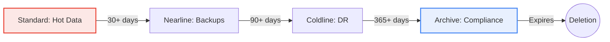

# SECTION 6: Cloud Storage (Buckets)

> **🎯 Objectives:**
> *   Master core concepts
> *   Build hands-on resources
> *   Pass the ACE exam scenarios

| 📚 Concepts | 🧪 Lab | 📝 Quiz | 💼 Interview |
|---|---|---|---|
| [Jump to Theory](#concepts) | [Jump to Lab](#hands-on-lab) | [Jump to Quiz](#knowledge-check) | [Jump to Interview](#interview-questions) |

---


> **🎯 Objectives:**
> *   Master core concepts
> *   Build hands-on resources
> *   Pass the ACE exam scenarios

| 📚 Concepts | 🧪 Lab | 📝 Quiz | 💼 Interview |
|---|---|---|---|
| [Jump to Theory](#concepts) | [Jump to Lab](#hands-on-lab) | [Jump to Quiz](#knowledge-check) | [Jump to Interview](#interview-questions) |

---


> **🎯 Objectives:**
> *   Master core concepts
> *   Build hands-on resources
> *   Pass the ACE exam scenarios

| 📚 Concepts | 🧪 Lab | 📝 Quiz | 💼 Interview |
|---|---|---|---|
| [Jump to Theory](#concepts) | [Jump to Lab](#hands-on-lab) | [Jump to Quiz](#knowledge-check) | [Jump to Interview](#interview-questions) |

---


**Duration:** ⏱️ 45 Minutes  
**Level:** Beginner  
**ACE Exam Weight:** ⭐⭐⭐⭐ High (Storage decisions appear in every exam)

> **Official Doc Reference**: [Cloud Storage Documentation](https://cloud.google.com/storage/docs)

---

> [!TIP]
> **TL;DR (Cloud Storage Essentials)**  
> Cloud Storage = Object storage (not a filesystem). 11 nines durability. **Storage classes:** Standard (hot, $0 retrieval) → Nearline (30 days) → Coldline (90 days) → Archive (365 days). Use **Signed URLs** for temporary access. **Bucket Lock** for compliance (WORM). Global strong consistency—upload in NY, read in Tokyo instantly.

---

## 🏢 Industry Context: Storage in Production

> [!NOTE]
> **Role Lens:** Every cloud role touches Cloud Storage daily. Know this service cold.

### Job Roles & Storage Usage

| Role | How They Use Storage | Day-to-Day Tasks |
|------|---------------------|------------------|
| **Cloud Engineer** | Manage buckets, lifecycle rules | Creating buckets, IAM, cross-project access |
| **Data Engineer** | Data lake storage | Ingestion, partitioned data, BigQuery integration |
| **DevOps Engineer** | Artifact storage, backups | Build artifacts, log archival |
| **Security Engineer** | Access control, compliance | UBLA, retention policies, audit logs |

### Production Patterns

| Pattern | Architecture | When to Use |
|---------|--------------|-------------|
| **Data Lake** | Standard for hot data + Lifecycle to Archive | Analytics, ML training data |
| **Static Website** | Public bucket + Cloud CDN | Marketing sites, docs |
| **Backup Pipeline** | Upload → Nearline (30d) → Coldline (90d) → Archive | Cost-optimized DR |

### ❌ Interview Mistakes to Avoid

| Mistake | Why It's Bad | What to Say Instead |
|---------|--------------|---------------------|
| "I make buckets public for sharing" | Security disaster | "I use Signed URLs for temporary access" |
| "I use Standard for everything" | Wasting money on cold data | "I set lifecycle rules to transition to Nearline/Coldline" |
| "I use ACLs for access control" | Outdated approach | "I use Uniform Bucket-Level Access with IAM" |

---

## 1️⃣ Overview: The "Infinite" Drive ♾️

## 2️⃣ Storage Classes (The Cost Ladder) 📉
Memorize the "Minimums".

| Class | Minimum Storage Duration | Use Case | Retrieval Cost |
| :--- | :--- | :--- | :--- |
| **Standard** | None | Frequent access. Hosting Websites. Streaming Video. | $0 |
| **Nearline** | **30 Days** | Backups (1x/month). | Low |
| **Coldline** | **90 Days** | Disaster Recovery (1x/quarter). | Medium |
| **Archive** | **365 Days** | Regulatory Logs (1x/year). | High |

### Lifecycle Visualization


---

## 3️⃣ Location Types (Resilience)
1.  **Region:** One location (e.g., `us-central1`). Lowest cost.
2.  **Dual-Region:** Two specific regions (e.g., `us-central1` + `us-east1`).
    *   *Superpower:* If one region goes offline (hurricane), your data is available in the other. **99.99% SLA**.
3.  **Multi-Region:** A large area (e.g., `US` or `EU`). Good for content delivery.

---

## 4️⃣ Security & Access 🔐
*   **Uniform Bucket-Level Access (UBLA):** The modern standard. "Everyone in Group X can read ALL files." (Simpler).
*   **Signed URLs:** Creating a temporary "Key" to access a file.
    *   *Usage:* Let a user upload a profile picture *directly* to the bucket without giving them your password.
*   **Retention Policy (Bucket Lock):**
    *   **WORM** (Write Once, Read Many).
    *   *Regulatory:* "This file CANNOT be deleted for 7 years." (SEC Rule 17a-4).
    *   *Warning:* If you lock it, **even YOU cannot delete it.**

---

## 5️⃣ Hands-On Lab: Host a Serverless Website 🌐
**Mission:** Host a public website for almost $0/month. No servers to manage!

1.  **Create Bucket:**
    *   Go to **Cloud Storage** > **Buckets** > **Create**.
    *   **Name:** `my-cool-website-[YOUR_NAME]` (Must be globally unique!).
    *   **Services:** Uncheck "Enforce public access prevention" (Because we want it public).
2.  **Grant Access:**
    *   Go to **Permissions** tab.
    *   Click **Grant Access**.
    *   **New Principals:** `allUsers` (This means "The Internet").
    *   **Role:** `Storage Object Viewer` (Read Only).
    *   **Save.**
3.  **Upload Files:**
    *   Create a file `index.html` on your desktop: `<h1>Hello from Cloud Storage!</h1>`
    *   Upload it to the bucket.
4.  **Visit It:**
    *   Click `index.html`. Copy the **Public URL**.
    *   Paste it in Chrome. You have a live website!

---


## 6️⃣ Checkpoint Quiz

1. **You need to store tax records for exactly 7 years to meet legal requirements. No one, not even the admin, should be able to delete them. What feature do you use?**
    * A. Standard Storage Class
    * B. Lifecycle Rule
    * C. **Retention Policy (Bucket Lock)** ✅
    * D. Signed URL

2. **Your application allows users to upload profile photos. You want the user to upload directly to the bucket without routing traffic through your web server. What should you generate?**
    * A. A Service Account Key
    * B. **A Signed URL** ✅
    * C. A Public Bucket
    * D. An ACL (Access Control List)

3. **What is the retrieval cost for "Standard" storage?**
    * A. **$0 (Free retrieval)** ✅
    * B. High cost
    * C. Depends on the file type


---

### ⚡ Zero-to-Hero: Pro Tips
*   **Dual-Region:** Always use Dual-Region for production data. It costs slightly more than Region, but it saves your life if a region goes down.
*   **Command Line:** `gcloud storage cp file.txt gs://my-bucket/` is the command you'll use 1000 times a day. Learn it.

---
<!-- FLASHCARDS
[
  {"term": "Bucket", "def": "A container for objects. Must have a globally unique name."},
  {"term": "Standard Storage", "def": "Hot data. Frequent access. No retrieval fee."},
  {"term": "Archive Storage", "def": "Coldest data. Backup once a year. High retrieval fee."},
  {"term": "Signed URL", "def": "A URL that gives temporary permission to upload/download an object."},
  {"term": "Uniform Bucket-Level Access", "def": "Disables ACLs. Uses IAM for the whole bucket. Recommended."}
]
-->
---

### 🗑️ Lab Cleanup (Mandatory)

> **⚠️ Critical:** Delete resources to avoid unecessary billing!

1.  **Delete Project:** (Fastest way)
    ```bash
    gcloud projects delete $PROJECT_ID
    ```
2.  **Or Delete Resources Individually:**
    ```bash
    # Example commands (verify before running)
    gcloud compute instances delete [INSTANCE_NAME] --quiet
    gcloud storage rm -r gs://[BUCKET_NAME]
    ```