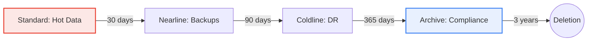

# SECTION 6: Cloud Storage (Buckets)

> **Official Doc Reference**: [Cloud Storage Documentation](https://cloud.google.com/storage/docs)

## 1️⃣ Overview: The "Hole" in the Cloud
Cloud Storage is **Object Storage**. It is NOT a filesystem (like NTFS or EXT4).
*   **Capacity:** Infinite.
*   **Durability:** **11 Nines** (99.999999999%). Practically verified to never lose data.
*   **Consistency:** **Global Strong Consistency**. If you write `file.txt` and immediately read `file.txt` in Japan, you get the NEW version. (GCP is famous for this; AWS took years to catch up).

## 2️⃣ Storage Classes (The Cost Ladder)
Memorize the "Minimums".

| Class | Minimum Storage Duration | Use Case | Retrieval Cost |
| :--- | :--- | :--- | :--- |
| **Standard** | None | Frequent access (Websites, App Data). | $0 |
| **Nearline** | **30 Days** | Backups (1x/month). | Low |
| **Coldline** | **90 Days** | Disaster Recovery (1x/quarter). | Medium |
| **Archive** | **365 Days** | Regulatory Logs (1x/year). | High |

> **Exam Trap:** "You have data you need to access once a year, but you need it INSTANTLY when you do."
> *   **Answer:** Archive. (Archive is milliseconds access time, unlike AWS Glacier which can take hours).

### Lifecycle Visualization


## 3️⃣ Location Types (Resilience)
1.  **Region:** One location (e.g., `us-central1`).
    *   *Cost:* Lowest.
    *   *SLA:* 99.9%
2.  **Dual-Region:** Two specific regions (e.g., `us-central1` AND `us-east1`).
    *   *Benefit:* Optimized for Turbo Replication and High Availability. **If Iowa burns down, your data is safe in South Carolina.**
3.  **Multi-Region:** Large area (e.g., `US` or `EU`).
    *   *Benefit:* Content Delivery (Geo-Redundancy).

## 4️⃣ Lifecycle Management & Autoclass
You don't want to manually move files to Coldline.
*   **Lifecycle Rules:** "If `age > 30` days, SetStorageClass to `Nearline`."
*   **Autoclass:** A checkbox that lets Google AI move your files up and down classes automatically.

### Retention Policy (Bucket Lock) 🔒
*   **What:** Enforces WORM (Write Once, Read Many).
*   **Example:** "This file CANNOT be deleted for 7 years." (SEC Rule 17a-4 for Finance).
*   **Trap:** If you "Lock" the policy, even **You** (the Admin) cannot delete the bucket until the timer expires. Be careful!
*   *VS Lifecycle:* Lifecycle deletes things; Retention prevents deletion.

## 5️⃣ Security: IAM vs ACLs vs Signed URLs
*   **Uniform Bucket-Level Access (UBLA):** The new standard. "All users in group X can read ALL files."
    *   *Disables:* ACLs (Fine-grained "User A can read File Y").
*   **Signed URLs:** Key concept.
    *   *Scenario:* User uploads a profile picture directly to your bucket.
    *   *Solution:* Generate a "Signed URL" valid for 15 minutes. The user PUTs to that URL. No Credentials needed on their device.

## 6️⃣ Hands-On Lab: The "Lifecycle" Test ♻️
**Mission:** Create a bucket that deletes temp files after 1 day.

1.  **Create Bucket:** `gcloud storage buckets create gs://my-temp-bucket-99`
2.  **Define Rule (JSON):**
    ```json
    {
      "rule": [{"action": {"type": "Delete"}, "condition": {"age": 1}}]
    }
    ```
3.  **Apply Rule:** `gcloud storage buckets update gs://my-temp-bucket-99 --lifecycle-file=lifecycle.json`
4.  **Verify:** `gcloud storage buckets describe gs://my-temp-bucket-99`

## 7️⃣ Checkpoint Questions
**Q1. You need to store regulatory documents for 7 years to meet SEC 17a-4 requirements. The data must be immutable (cannot be deleted). What feature do you enable?**
*   A. Versioning
*   B. Retention Policy (Bucket Lock)
*   C. Lifecycle Rule
*   D. IAM Policy
> **Answer: B.** Retention Policies enforce WORM (Write Once Read Many). Locking it makes it irreversible.

**Q2. Which storage class is best for data accessed once a quarter (e.g., 90 days)?**
*   A. Standard
*   B. Nearline
*   C. Coldline
*   D. Archive
> **Answer: C.** Coldline is optimized for 90-day access patterns.

**Q3. You want to allow a specific user to upload a file to your bucket *without* giving them a Google Account. What is the best method?**
*   A. Make the bucket public (allUsers).
*   B. Generate a Signed URL.
*   C. Give them the Service Account Key.
*   D. Use Cloud CDN.
> **Answer: B.** Signed URLs provide temporary, secure access without credentials.

**Q4. What is the "consistency" model of Cloud Storage?**
*   A. Eventual Consistency for all operations.
*   B. Strong Consistency for overwrites, Eventual for new files.
*   C. Global Strong Consistency for all operations.
*   D. Read-after-Write consistency only in one region.
> **Answer: C.** Cloud Storage offers strong global consistency for read-after-write.

**Q5. You accidentally deleted a critical file. Which feature would have allowed you to restore the previous version?**
*   A. Lifecycle Management
*   B. Object Versioning
*   C. Autoclass
*   D. Retention Policy
> **Answer: B.** Object Versioning keeps history of overwrites and deletions.

**Q6. What happens if you try to access "Archive" class data instantly?**
*   A. You cannot; you must wait 4 hours.
*   B. It works immediately (milliseconds), but costs more to retrieve.
*   C. It works immediately and is free.
*   D. You must first "thaw" the data to Standard class.
> **Answer: B.** Unlike AWS Glacier, GCP Archive has instant retrieval (milliseconds) but high data retrieval costs.


<!-- FLASHCARDS
[
  {
    "term": "Bucket",
    "def": "Container for objects (files). Must have a globally unique name."
  },
  {
    "term": "Standard Class",
    "def": "Hot data. Access frequently. Best for serving web assets."
  },
  {
    "term": "Nearline",
    "def": "Data accessed < 1/month. 30-day min storage fee."
  },
  {
    "term": "Coldline",
    "def": "Data accessed < 1/quarter. 90-day min storage fee."
  },
  {
    "term": "Archive",
    "def": "Deep freeze backup. < 1/year. 365-day min storage fee."
  },
  {
    "term": "Signed URL",
    "def": "Temporary time-bound access key for a specific file."
  }
]
-->