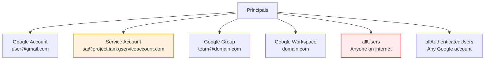
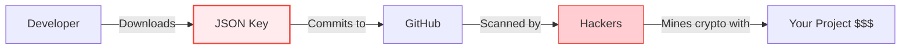

# Module 7: IAM & Identity

> **🎯 Objectives:**
> *   Master core concepts
> *   Build hands-on resources
> *   Pass the ACE exam scenarios

| 📚 Concepts | 🧪 Lab | 📝 Quiz | 💼 Interview |
|---|---|---|---|
| [Jump to Theory](#concepts) | [Jump to Lab](#hands-on-lab) | [Jump to Quiz](#knowledge-check) | [Jump to Interview](#interview-questions) |

---


> **🎯 Objectives:**
> *   Master core concepts
> *   Build hands-on resources
> *   Pass the ACE exam scenarios

| 📚 Concepts | 🧪 Lab | 📝 Quiz | 💼 Interview |
|---|---|---|---|
| [Jump to Theory](#concepts) | [Jump to Lab](#hands-on-lab) | [Jump to Quiz](#knowledge-check) | [Jump to Interview](#interview-questions) |

---


> **🎯 Objectives:**
> *   Master core concepts
> *   Build hands-on resources
> *   Pass the ACE exam scenarios

| 📚 Concepts | 🧪 Lab | 📝 Quiz | 💼 Interview |
|---|---|---|---|
| [Jump to Theory](#concepts) | [Jump to Lab](#hands-on-lab) | [Jump to Quiz](#knowledge-check) | [Jump to Interview](#interview-questions) |

---


**Duration:** ⏱️ 60 Minutes  
**Level:** Intermediate  
**ACE Exam Weight:** ⭐⭐⭐⭐⭐ Critical (Security is 19% of the exam!)

---

> [!TIP]
> **TL;DR (IAM in 30 Seconds)**  
> IAM answers: **WHO** (Principal) can do **WHAT** (Role/Permissions) on **WHICH** resource. Never use Basic roles (Owner/Editor/Viewer) in production — use Predefined roles. Never download Service Account JSON keys — use Workload Identity instead. Permissions flow **DOWN** the hierarchy (Org → Folder → Project → Resource).

---

## 🎯 Learning Objectives

| ✅ Skill | Why It Matters |
|---------|----------------|
| **Explain** WHO/WHAT/WHERE of IAM | Foundation of all GCP security |
| **Differentiate** role types | Pick the right level of access |
| **Apply** Least Privilege | Core security principle for ACE exam |
| **Secure** Service Accounts | Prevent crypto-mining attacks! |
| **Use** IAM Conditions | Time/IP-based access control |

---

## 🏢 Industry Context: Who Uses IAM Daily?

> [!NOTE]
> **Role Lens:** This section is critical for ALL cloud roles. Master this, and you'll stand out in interviews.

### Job Roles & IAM Usage

| Role | How They Use IAM | Day-to-Day Tasks |
|------|------------------|------------------|
| **Cloud Engineer** | Grant developers access to resources | Creating SAs, assigning predefined roles |
| **Security Engineer** | Audit permissions, enforce least privilege | Running IAM Recommender, reviewing policies |
| **DevOps Engineer** | Set up CI/CD service accounts | Workload Identity for GitHub/GitLab |
| **SRE** | Incident response, permission audits | Investigating compromised credentials |
| **Platform Engineer** | Design org-wide IAM strategy | Custom roles, Org Policies |

### Real Production Patterns

| Pattern | Architecture | When to Use |
|---------|--------------|-------------|
| **Team-Based Access** | Google Group → Predefined Role → Project | Standard team permissions |
| **Service Mesh** | SA per microservice → least privilege | Microservices on GKE |
| **Cross-Project Access** | SA impersonation across projects | Shared services (logging, monitoring) |
| **External CI/CD** | Workload Identity Federation | GitHub Actions, GitLab CI |

### ❌ Beginner Mistakes That Get You Rejected in Interviews

| Mistake | Why It's Bad | What to Say Instead |
|---------|--------------|---------------------|
| "I use Owner role for simplicity" | Shows no security awareness | "I use predefined roles with least privilege" |
| "I download JSON keys for CI/CD" | Security red flag | "I use Workload Identity Federation" |
| "I grant to individual users" | Doesn't scale | "I use Google Groups for scalability" |

### 🔍 Role Lens: What Each Role Focuses On

> **🔵 Cloud Engineer:** Focus on granting access correctly. Know predefined roles by heart. Understand Service Accounts for VMs.

> **🟢 DevOps Engineer:** Master Workload Identity Federation for CI/CD. Know how to eliminate JSON keys from your pipelines.

> **🟠 Security Engineer:** Know IAM Recommender, how to audit policies, and incident response for leaked credentials.

> **🔴 SRE:** Focus on least privilege for production workloads and how to quickly revoke compromised credentials.

---

## 🧠 1. What Is IAM? (Plain-English)

**IAM = The bouncer at your cloud's door.**

It controls **WHO** (Identity) can do **WHAT** (Permissions) on **WHICH** resource.

### The IAM Equation

```
Principal + Role = Access (at a specific level in the Hierarchy)
```

> [!IMPORTANT]
> **Policy Inheritance:** Permissions flow **DOWN** the tree (Org → Folder → Project → Resource). If you are an Editor at the Project level, you are an Editor on every VM in that project. **You cannot "un-grant" a permission further down.**

### 💡 Real-World Analogy: Hotel Key Card

| IAM Concept | Hotel Analogy |
|-------------|---------------|
| **Principal** | The guest (you) |
| **Role** | Access level (Guest, VIP, Housekeeping) |
| **Permissions** | Individual actions (open gym, open room 202) |
| **Resource** | The hotel room or facility |
| **Policy** | The key card programming |

---

## 👥 2. Who Can Access? (Principals)

### Types of Principals



> **⚠️ Warning:** `allUsers` and `allAuthenticatedUsers` can expose resources publicly. Use with extreme caution!

---

## 📜 3. Types of Roles

### Role Comparison

| Role Type | Created By | Maintenance | Best For |
|-----------|-----------|-------------|----------|
| **Basic (Primitive)** | Google | None | ⛔ Avoid in production |
| **Predefined** | Google | Auto-updated | ✅ Most use cases |
| **Custom** | You | Manual | 🛠️ Specific needs |

### Basic Roles (Avoid These!)

| Role | Permissions |
|------|-------------|
| **Viewer** | Read-only access |
| **Editor** | Read + Write (but not IAM) |
| **Owner** | Full control including IAM & billing |

> **🎯 ACE Tip:** If an exam question uses Basic roles as an answer, it's usually WRONG. Look for the Predefined role option.

### Predefined Roles (Use These!)
```
roles/storage.objectViewer     # Only view objects
roles/storage.objectAdmin      # Manage objects
roles/compute.instanceAdmin    # Manage VMs
roles/bigquery.dataViewer      # Query BigQuery
```

### Custom Roles
```bash
# Create custom role with specific permissions
gcloud iam roles create customStorageViewer \
    --project=my-project \
    --title="Custom Storage Viewer" \
    --permissions="storage.objects.get,storage.objects.list" \
    --stage=GA
```

---

## 🤖 4. Service Accounts (Machine Identities)

**Humans use passwords. Machines use Service Accounts.**

### Types of Service Accounts

| Type | Created By | Example |
|------|-----------|---------|
| **Default** | GCP (auto) | Compute Engine default SA |
| **User-managed** | You | Custom app SA |
| **Google-managed** | Google | Cloud Build service agent |

### ⚠️ The JSON Key Problem



### Best Practices
```bash
# ✅ GOOD: Use attached service account
gcloud compute instances create my-vm \
    --service-account=my-sa@project.iam.gserviceaccount.com

# ✅ BEST: Use Workload Identity Federation (WIF)
# Allows external identities (GitHub, Azure) to assume a GCP role WITHOUT long-lived JSON keys.
```

### 🧠 Strategic Comparison: IAM vs. Org Policy
| Feature | IAM | Org Policy |
|---------|-----|------------|
| **Focus** | **Identity** (Who can do it?) | **Resource** (What can be done?) |
| **Action** | **Allow-only** | **Allow or Deny** (often used for Deny) |
| **Logic** | **Union:** If any policy allows it, it's allowed. | **Restriction:** If any policy denies it, it's blocked. |
| **Precedence** | Lower levels add permissions. | Higher levels set guardrails that lower levels cannot break. |

---

## 🎯 5. IAM Conditions (Context-Aware Access)

Add **WHEN** and **WHERE** to your access rules.

### Condition Types

| Condition | Use Case |
|-----------|----------|
| **Time-based** | Access only during business hours |
| **IP-based** | Access only from corporate VPN |
| **Resource-based** | Access only to `dev-*` resources |
| **Expiring** | Temporary contractor access |

### Example: Weekdays Only Access
```bash
gcloud projects add-iam-policy-binding my-project \
    --member="user:contractor@example.com" \
    --role="roles/storage.objectViewer" \
    --condition='
      expression=request.time.getDayOfWeek() >= 1 && request.time.getDayOfWeek() <= 5,
      title=WeekdaysOnly,
      description=Access only on weekdays'
```

---

## 🛠️ 6. Hands-On Lab: Least Privilege in Action

### Step 1: Create a Service Account
```bash
gcloud iam service-accounts create storage-reader \
    --display-name="Storage Reader SA"
```

### Step 2: Grant Minimal Permissions
```bash
# Only grant what's needed - object viewer, not admin
gcloud projects add-iam-policy-binding my-project \
    --member="serviceAccount:storage-reader@my-project.iam.gserviceaccount.com" \
    --role="roles/storage.objectViewer"
```

### Step 3: Create VM with SA
```bash
gcloud compute instances create reader-vm \
    --service-account=storage-reader@my-project.iam.gserviceaccount.com \
    --scopes=storage-ro \
    --zone=us-central1-a
```

### Step 4: Verify Permissions
```bash
# SSH into VM
gcloud compute ssh reader-vm --zone=us-central1-a

# This should work
gcloud storage ls gs://my-bucket/

# This should FAIL (no write permission)
echo "test" | gcloud storage cp - gs://my-bucket/test.txt
```

---

## ⚠️ 7. Exam Traps & Pro Tips

### ❌ Common Mistakes
| Mistake | Reality |
|---------|---------|
| "Use Owner role for simplicity" | No! Always use Predefined roles |
| "Download SA keys for CI/CD" | No! Use Workload Identity Federation |
| "Grant permissions to users directly" | No! Use Google Groups for scalability |

### ✅ Pro Tips
*   **Use Groups** - Add permissions to groups, add users to groups
*   **Audit with IAM Recommender** - Find unused permissions
*   **Never use Basic roles** in production
*   **Rotate SA keys** if you must use them (ideally, don't)

---

## 🚨 8. Incident Response: JSON Key Leaked to GitHub

> [!CAUTION]
> **Real-World Scenario:** Your security team alerts you that a service account JSON key was committed to a public GitHub repository. The key has Editor permissions on your production project.

### Immediate Response (< 5 minutes)

```bash
# Step 1: Disable the key IMMEDIATELY
gcloud iam service-accounts keys disable KEY_ID \
    --iam-account=compromised-sa@PROJECT.iam.gserviceaccount.com

# Step 2: Delete the key
gcloud iam service-accounts keys delete KEY_ID \
    --iam-account=compromised-sa@PROJECT.iam.gserviceaccount.com

# Step 3: Check for suspicious activity
gcloud logging read 'protoPayload.authenticationInfo.principalEmail="compromised-sa@PROJECT.iam.gserviceaccount.com"' \
    --limit=50 --format="table(timestamp,protoPayload.methodName)"
```

### Investigate Impact

```bash
# What did they access?
gcloud logging read 'protoPayload.authenticationInfo.principalEmail="compromised-sa@PROJECT.iam.gserviceaccount.com" AND timestamp>="2024-01-01T00:00:00Z"' \
    --format=json > incident_log.json
```

### Post-Incident

1. Create new SA with **least privilege** (not Editor!)
2. Implement **Workload Identity** instead of JSON keys
3. Set up **Secret Manager** for any remaining secrets
4. Add **IAM Recommender** alerts

> **💼 Interview Tip:** When asked about incident response, always mention: Disable → Delete → Investigate → Prevent Recurrence.

---

## 💼 9. Interview Question Bank

### Beginner Level (Conceptual)

**Q1: What is the difference between a Role and a Permission?**
> **Strong Answer:** "A permission is a single action like `storage.objects.get`. A role is a collection of permissions bundled together. For example, `roles/storage.objectViewer` contains multiple read permissions. I always use predefined roles instead of granting individual permissions for maintainability."

**Q2: Why should you avoid using Basic Roles (Owner/Editor/Viewer)?**
> **Strong Answer:** "Basic roles are too broad. Editor grants write access to almost everything in a project, including resources the user doesn't need. This violates least privilege and increases blast radius if credentials are compromised. I use predefined roles like `roles/compute.instanceAdmin` for specific access."

### Intermediate Level (Trade-offs)

**Q3: When would you create a Custom Role vs using a Predefined Role?**
> **Strong Answer:** "I use predefined roles 95% of the time because Google maintains them and adds new permissions automatically. I create custom roles only when predefined roles are too permissive AND there's no narrower option. The trade-off is maintenance—I have to update custom roles when APIs change."

**Q4: How do you decide between granting permissions to individual users vs Google Groups?**
> **Strong Answer:** "I always use Google Groups. It scales better—when someone joins or leaves a team, I update group membership, not project IAM. It also creates a cleaner audit trail. The trade-off is the extra step of group management, but it's worth it for any team larger than 3 people."

### Advanced Level (Scenario-Based)

**Q5: Your CI/CD pipeline needs to deploy to GKE and push images to Artifact Registry. How do you set this up securely?**
> **Strong Answer:** "I use Workload Identity Federation to eliminate JSON keys. For GitHub Actions, I create a Workload Identity Pool, configure the OIDC provider with GitHub's issuer URL, and grant the pool permission to impersonate a service account. The SA gets `roles/artifactregistry.writer` and `roles/container.developer`—no more, no less."

**Q6: A developer reports 'Permission Denied' when trying to create a VM. Walk me through troubleshooting.**
> **Strong Answer:**
> 1. **Check their identity:** `gcloud auth list` to confirm which account they're using
> 2. **Check project:** `gcloud config get-value project` 
> 3. **Check IAM binding:** `gcloud projects get-iam-policy PROJECT | grep -A2 developer@`
> 4. **Test permissions:** `gcloud alpha iam test-iam-permissions --project=PROJECT --permissions=compute.instances.create`
> 5. **Check Org Policies:** Could be blocked at org/folder level
> "Most common cause is wrong project or wrong account. Second is the role is bound at resource level, not project level."

**Q7: Design IAM for a startup with 3 teams: Dev, QA, and Ops. Each needs different access to 2 projects: dev-project and prod-project.**
> **Strong Answer:**
> - Create 3 Google Groups: `dev@company.com`, `qa@company.com`, `ops@company.com`
> - **dev-project:**
>   - Dev → `roles/editor` (they build here)
>   - QA → `roles/viewer` (read-only)
>   - Ops → `roles/compute.admin` (manage infra)
> - **prod-project:**
>   - Dev → `roles/viewer` (can debug, can't change)
>   - QA → `roles/viewer`
>   - Ops → `roles/owner` (full control)
> - Use Org Policy to prevent public buckets in prod
> "I'd also set up IAM Conditions so Dev can only access prod during incidents with approval."

---

<!-- QUIZ_START -->
## 📝 8. Knowledge Check Quiz

1. **Which role type should you generally AVOID in production?**
    *   A. Predefined
    *   B. **Basic (Primitive)** ✅
    *   C. Custom
    *   D. Viewer

2. **What is the "Principle of Least Privilege"?**
    *   A. **Give only the permissions needed to do the job** ✅
    *   B. Give everyone Owner access
    *   C. Use only Service Accounts
    *   D. Always use custom roles

3. **An identity for an application to make API calls is called a:**
    *   A. User Account
    *   B. **Service Account** ✅
    *   C. Billing Account
    *   D. Organization Account

4. **You need to grant temporary access to a contractor that expires automatically. What should you use?**
    *   A. Basic Roles
    *   B. Custom Roles
    *   C. **IAM Conditions with expiration** ✅
    *   D. Service Account keys

5. **Which feature allows access based on the user's IP address or time of day?**
    *   A. Basic Roles
    *   B. **IAM Conditions** ✅
    *   C. Service Accounts
    *   D. VPC Firewall Rules
<!-- QUIZ_END -->

---

## ✅ Day 6 Checklist

- [ ] Understand Principal, Role, and Policy
- [ ] Know why Basic roles are risky
- [ ] Create a least-privilege Service Account
- [ ] Apply an IAM Condition
- [ ] Complete the hands-on lab

---

<!-- FLASHCARDS
[
  {"term": "Principal", "def": "WHO can access. User, Service Account, Group, or Domain."},
  {"term": "Role", "def": "WHAT permissions. Collection of specific actions allowed."},
  {"term": "Policy", "def": "Binding that attaches Principal to Role on a Resource."},
  {"term": "Least Privilege", "def": "Grant only the minimum permissions needed. Core security principle."},
  {"term": "Service Account", "def": "Identity for applications. Use instead of user accounts for machines."},
  {"term": "IAM Conditions", "def": "Context-aware access. Add TIME, IP, or RESOURCE constraints to policies."},
  {"term": "Basic Roles", "def": "Owner/Editor/Viewer. Too broad for production. Use Predefined instead."}
]
-->
---

### 🗑️ Lab Cleanup (Mandatory)

> **⚠️ Critical:** Delete resources to avoid unecessary billing!

1.  **Delete Project:** (Fastest way)
    ```bash
    gcloud projects delete $PROJECT_ID
    ```
2.  **Or Delete Resources Individually:**
    ```bash
    # Example commands (verify before running)
    gcloud compute instances delete [INSTANCE_NAME] --quiet
    gcloud storage rm -r gs://[BUCKET_NAME]
    ```