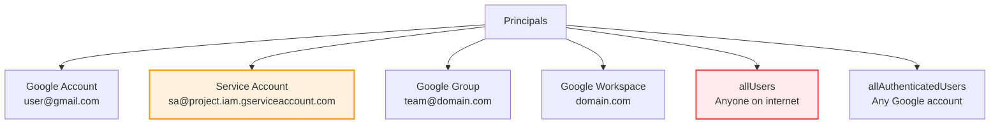
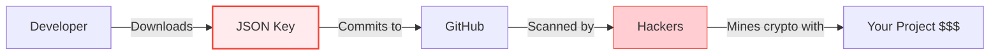

# Day 6: IAM (Identity & Access Management)

**Duration:** ⏱️ 60 Minutes  
**Level:** Intermediate  
**ACE Exam Weight:** ⭐⭐⭐⭐⭐ Critical (Security is 19% of the exam!)

---

## 🎯 Learning Objectives

By the end of Day 6, you will be able to:

*   **Explain** the WHO, WHAT, WHERE of IAM
*   **Differentiate** between Basic, Predefined, and Custom roles
*   **Apply** the Principle of Least Privilege
*   **Secure** Service Accounts properly
*   **Use** IAM Conditions for context-aware access

---

## 🧠 1. What Is IAM? (Plain-English)

**IAM = The bouncer at your cloud's door.**

It controls **WHO** (Identity) can do **WHAT** (Permissions) on **WHICH** resource.

### The IAM Equation

```
Principal + Role = Access to Resource
```

### 💡 Real-World Analogy: Hotel Key Card

| IAM Concept | Hotel Analogy |
|-------------|---------------|
| **Principal** | The guest (you) |
| **Role** | Access level (Guest, VIP, Housekeeping) |
| **Permissions** | Individual actions (open gym, open room 202) |
| **Resource** | The hotel room or facility |
| **Policy** | The key card programming |

---

## 👥 2. Who Can Access? (Principals)

### Types of Principals



> **⚠️ Warning:** `allUsers` and `allAuthenticatedUsers` can expose resources publicly. Use with extreme caution!

---

## 📜 3. Types of Roles

### Role Comparison

| Role Type | Created By | Maintenance | Best For |
|-----------|-----------|-------------|----------|
| **Basic (Primitive)** | Google | None | ⛔ Avoid in production |
| **Predefined** | Google | Auto-updated | ✅ Most use cases |
| **Custom** | You | Manual | 🛠️ Specific needs |

### Basic Roles (Avoid These!)

| Role | Permissions |
|------|-------------|
| **Viewer** | Read-only access |
| **Editor** | Read + Write (but not IAM) |
| **Owner** | Full control including IAM & billing |

> **🎯 ACE Tip:** If an exam question uses Basic roles as an answer, it's usually WRONG. Look for the Predefined role option.

### Predefined Roles (Use These!)
```
roles/storage.objectViewer     # Only view objects
roles/storage.objectAdmin      # Manage objects
roles/compute.instanceAdmin    # Manage VMs
roles/bigquery.dataViewer      # Query BigQuery
```

### Custom Roles
```bash
# Create custom role with specific permissions
gcloud iam roles create customStorageViewer \
    --project=my-project \
    --title="Custom Storage Viewer" \
    --permissions="storage.objects.get,storage.objects.list" \
    --stage=GA
```

---

## 🤖 4. Service Accounts (Machine Identities)

**Humans use passwords. Machines use Service Accounts.**

### Types of Service Accounts

| Type | Created By | Example |
|------|-----------|---------|
| **Default** | GCP (auto) | Compute Engine default SA |
| **User-managed** | You | Custom app SA |
| **Google-managed** | Google | Cloud Build service agent |

### ⚠️ The JSON Key Problem



### Best Practices
```bash
# ❌ BAD: Download keys
gcloud iam service-accounts keys create key.json

# ✅ GOOD: Use attached service account
gcloud compute instances create my-vm \
    --service-account=my-sa@project.iam.gserviceaccount.com

# ✅ BEST: Use Workload Identity (no keys at all!)
```

---

## 🎯 5. IAM Conditions (Context-Aware Access)

Add **WHEN** and **WHERE** to your access rules.

### Condition Types

| Condition | Use Case |
|-----------|----------|
| **Time-based** | Access only during business hours |
| **IP-based** | Access only from corporate VPN |
| **Resource-based** | Access only to `dev-*` resources |
| **Expiring** | Temporary contractor access |

### Example: Weekdays Only Access
```bash
gcloud projects add-iam-policy-binding my-project \
    --member="user:contractor@example.com" \
    --role="roles/storage.objectViewer" \
    --condition='
      expression=request.time.getDayOfWeek() >= 1 && request.time.getDayOfWeek() <= 5,
      title=WeekdaysOnly,
      description=Access only on weekdays'
```

---

## 🛠️ 6. Hands-On Lab: Least Privilege in Action

### Step 1: Create a Service Account
```bash
gcloud iam service-accounts create storage-reader \
    --display-name="Storage Reader SA"
```

### Step 2: Grant Minimal Permissions
```bash
# Only grant what's needed - object viewer, not admin
gcloud projects add-iam-policy-binding my-project \
    --member="serviceAccount:storage-reader@my-project.iam.gserviceaccount.com" \
    --role="roles/storage.objectViewer"
```

### Step 3: Create VM with SA
```bash
gcloud compute instances create reader-vm \
    --service-account=storage-reader@my-project.iam.gserviceaccount.com \
    --scopes=storage-ro \
    --zone=us-central1-a
```

### Step 4: Verify Permissions
```bash
# SSH into VM
gcloud compute ssh reader-vm --zone=us-central1-a

# This should work
gcloud storage ls gs://my-bucket/

# This should FAIL (no write permission)
echo "test" | gcloud storage cp - gs://my-bucket/test.txt
```

---

## ⚠️ 7. Exam Traps & Pro Tips

### ❌ Common Mistakes
| Mistake | Reality |
|---------|---------|
| "Use Owner role for simplicity" | No! Always use Predefined roles |
| "Download SA keys for CI/CD" | No! Use Workload Identity Federation |
| "Grant permissions to users directly" | No! Use Google Groups for scalability |

### ✅ Pro Tips
*   **Use Groups** - Add permissions to groups, add users to groups
*   **Audit with IAM Recommender** - Find unused permissions
*   **Never use Basic roles** in production
*   **Rotate SA keys** if you must use them (ideally, don't)

---

<!-- QUIZ_START -->
## 📝 8. Knowledge Check Quiz

1. **Which role type should you generally AVOID in production?**
    *   A. Predefined
    *   B. **Basic (Primitive)** ✅
    *   C. Custom
    *   D. Viewer

2. **What is the "Principle of Least Privilege"?**
    *   A. **Give only the permissions needed to do the job** ✅
    *   B. Give everyone Owner access
    *   C. Use only Service Accounts
    *   D. Always use custom roles

3. **An identity for an application to make API calls is called a:**
    *   A. User Account
    *   B. **Service Account** ✅
    *   C. Billing Account
    *   D. Organization Account

4. **You need to grant temporary access to a contractor that expires automatically. What should you use?**
    *   A. Basic Roles
    *   B. Custom Roles
    *   C. **IAM Conditions with expiration** ✅
    *   D. Service Account keys

5. **Which feature allows access based on the user's IP address or time of day?**
    *   A. Basic Roles
    *   B. **IAM Conditions** ✅
    *   C. Service Accounts
    *   D. VPC Firewall Rules
<!-- QUIZ_END -->

---

## ✅ Day 6 Checklist

- [ ] Understand Principal, Role, and Policy
- [ ] Know why Basic roles are risky
- [ ] Create a least-privilege Service Account
- [ ] Apply an IAM Condition
- [ ] Complete the hands-on lab

---

<!-- FLASHCARDS
[
  {"term": "Principal", "def": "WHO can access. User, Service Account, Group, or Domain."},
  {"term": "Role", "def": "WHAT permissions. Collection of specific actions allowed."},
  {"term": "Policy", "def": "Binding that attaches Principal to Role on a Resource."},
  {"term": "Least Privilege", "def": "Grant only the minimum permissions needed. Core security principle."},
  {"term": "Service Account", "def": "Identity for applications. Use instead of user accounts for machines."},
  {"term": "IAM Conditions", "def": "Context-aware access. Add TIME, IP, or RESOURCE constraints to policies."},
  {"term": "Basic Roles", "def": "Owner/Editor/Viewer. Too broad for production. Use Predefined instead."}
]
-->
