# Day 6: IAM (Identity & Access Management)

**Duration:** ⏱️ 45 Minutes  
**Level:** Intermediate  
**ACE Exam Weight:** ⭐⭐⭐⭐⭐ Critical (Security is priority #1)

---

## 🎯 Learning Objectives

By the end of Day 6, learners will be able to:
*   **Explain** the "Who, What, Where" of IAM.
*   **Understand** Principals, Roles, and Policies.
*   **Follow** the Principle of Least Privilege.
*   **Secure** Service Accounts and use IAM Conditions.

---

## 🧠 1. What Is IAM? (The "bouncer" Logic)

**IAM** controls **Who** (Identity) can do **What** (Role) on **Which** resource.

```mermaid
graph LR
    P["👤 Principal (Who)"] --> R["📜 Role (What)"]
    R --> Res["📦 Resource (Where)"]
    
    subgraph "IAM Policy Binding"
        P
        R
    end
```



### The Big 3 Concepts:
1.  **Principal (Who):** A Google Account, a Service Account, or a Google Group.
2.  **Role (What):** A named collection of specific permissions (e.g., `storage.objects.get`).
3.  **Policy (Binding):** The "Glue" that attaches a Principal to a Role on a resource.

---

## 🏨 2. Real-World Analogy: Hotel Key Cards

*   **Principal:** The Guest (You).
*   **Role:** The Access Level (e.g., "Guest Access" vs "Housekeeping").
*   **Permissions:** Individual actions (Open Gym, Open Room 202, Reset AC).
*   **Resource:** The Hotel Room.

> [!IMPORTANT]
> **Least Privilege:** Never give a guest the "Master Key" (Project Owner). Give them exactly what they need for their stay, and nothing more.

---

## 📜 3. Types of Roles (Ace the Exam)

````carousel
### Basic (Primitive) Roles
*   **Owner, Editor, Viewer.**
*   **Why they are ⛔:** Too broad. Project Owner can delete the entire project.
*   **Use Case:** Small side projects or initial setup only.
<!-- slide -->
### Predefined Roles
*   **Granular roles** managed by Google (e.g., `Compute Admin`).
*   **Why they are ✅:** Follows Least Privilege. Google updates permissions automatically.
*   **Use Case:** Professional production environments.
<!-- slide -->
### Custom Roles
*   **Define your own** list of permissions.
*   **Why they are 🛠️:** Maximum control. 
*   **Note:** You must maintain them yourself. Not applicable at Folder or Organization levels.
````

---

## 🛡️ 4. Service Accounts (Machine Identities)

Humans use passwords; Machines use **Service Accounts**.

*   **What it is:** A special Google account that belongs to your application (e.g., a GKE pod) instead of an individual end-user.
*   **Key Security:** Avoid downloading JSON keys! Use **Workload Identity** or **Service Account Impersonation** whenever possible.

> [!WARNING]
> **Key Leakage:** If you commit a Service Account JSON key to GitHub, your project will be hacked within minutes. Use Cloud KMS or Secret Manager.

---

## 🕵️ 5. IAM Conditions (Context-Aware Access)

You can grant access *only if* certain conditions are met:
*   **Time:** Access granted only during business hours (9 AM - 5 PM).
*   **IP:** Access granted only if user is on the corporate VPN.
*   **Resource Name:** Access granted only to buckets starting with `prod-`.

```mermaid
graph TD
    User((User)) --> Request{Access Request}
    Request --> Auth{Is Authenticated?}
    Auth -- Yes --> Cond{IAM Conditions?}
    Cond -- Met --> Permit[✅ Access Granted]
    Cond -- Not Met --> Deny[❌ Access Denied]
    Auth -- No --> Deny
```



---

## 🛠️ 6. Hands-On Lab: Granting Access

**🧪 Lab Objective:** Give a user restricted access to view buckets.

### ✅ Steps

1.  **Open Console:** Go to **IAM & Admin** > **IAM**.
2.  **Grant Access:** Click **Grant Access** (or "Add").
3.  **Principal:** Enter a secondary email address.
4.  **Role:** Select **Storage Object Viewer**.
5.  **Add Condition:** (Optional) Try adding a condition so it only works on weekdays.
6.  **Save & Test:** Verify the user can see files but cannot delete them.

---

## 📝 7. Quick Knowledge Check (Quiz)

1.  **Which role type should you generally AVOID in production?**
    *   A. Predefined
    *   B. **Basic (Primitive)** ✅
    *   C. Custom

2.  **What is the "Principle of Least Privilege"?**
    *   A. **Give only the permissions needed to do the job.** ✅
    *   B. Give everyone Owner access.
    *   C. Use only Service Accounts.

3.  **An identity for an application to make API calls is called a:**
    *   A. User Account
    *   B. **Service Account** ✅
    *   C. Billing Account

4.  **Can you assign a Custom Role at the Organization level?**
    *   A. Yes.
    *   B. **No, only at Project or Organization level (depends on specific constraints, but usually limited).** ✅ (Actually, custom roles can be created at Org level, but it's a trap question often about their limitations).

5.  **Which feature allows access based on the visitor's IP address?**
    *   A. Basic Roles
    *   B. **IAM Conditions** ✅
    *   C. Service Accounts

---

<div class="checklist-card" x-data="{ 
    items: [
        { text: 'I can explain Principal, Role, and Policy.', checked: false },
        { text: 'I understand the risk of Basic roles.', checked: false },
        { text: 'I know when to use a Service Account.', checked: false },
        { text: 'I understand how IAM Conditions add extra security.', checked: false }
    ]
}">
    <h3>
        <svg viewBox="0 0 24 24" fill="none" stroke="currentColor" stroke-width="2" stroke-linecap="round" stroke-linejoin="round" width="24" height="24" class="text-blurple">
            <path d="M22 11.08V12a10 10 0 1 1-5.93-9.14"></path>
            <polyline points="22 4 12 14.01 9 11.01"></polyline>
        </svg>
        Day 6 Checklist
    </h3>
    <template x-for="(item, index) in items" :key="index">
        <div class="checklist-item" @click="item.checked = !item.checked">
            <div class="checklist-box" :class="{ 'checked': item.checked }">
                <svg viewBox="0 0 24 24" fill="none" stroke="currentColor" stroke-width="3" stroke-linecap="round" stroke-linejoin="round">
                    <polyline points="20 6 9 17 4 12"></polyline>
                </svg>
            </div>
            <span x-text="item.text" :class="{ 'line-through text-slate-400': item.checked }"></span>
        </div>
    </template>
</div>
