# Week 1 Project: Hosting a Serverless Website

> **Objective**: By the end of this session, you will host a live, public website using Google Cloud Storage for pennies per month, without touching a single server.

## 🏗️ Architecture

```mermaid
graph LR
    User[🌍 User Browser] -- HTTP Request --> GCS[☁️ Google Cloud Storage Bucket]
    GCS -- Serves --> HTML[📄 index.html]
    GCS -- Serves --> JPG[🖼️ image.jpg]
    style GCS fill:#e8f0fe,stroke:#3b82f6,stroke-width:2px
```


## 🛠️ The Challenge
Your startup, "CloudCafe", needs a landing page. You have $0 budget for ops and hate managing Linux servers. You decide to use **Cloud Storage** as a web server.

### Prerequisites
- Active GCP Project
- Cloud Shell or Local Terminal with `gcloud` installed
- (Optional) A funny cat picture

---

## 🚀 Lab Steps

### Step 1: Create the Bucket
Buckets are global resources, so the name must be unique across *all* of Google Cloud.
1. Go to **Cloud Storage** > **Buckets**.
2. Click **Create**.
3. **Name**: `cloud-cafe-web-[YOUR_NAME]` (e.g., `cloud-cafe-web-jyothi-123`).
4. **Location**: Choose a `Region` near you (e.g., `us-central1`).
5. **Storage Class**: `Standard` (best for frequently accessed websites).
6. **Access Control**: Uncheck "Enforce public access prevention". **Crucial** for a website!
7. Click **Create**.

### Step 2: Create Your Website Files
Open a text editor (or Cloud Shell Editor) and create `index.html`:

```html
<!DOCTYPE html>
<html>
<head>
    <title>CloudCafe</title>
    <style>
        body { font-family: sans-serif; text-align: center; padding: 50px; background: #f0f9ff; }
        h1 { color: #0284c7; }
    </style>
</head>
<body>
    <h1>Welcome to CloudCafe ☕</h1>
    <p>Served 100% Serverless from Google Cloud Storage!</p>
</body>
</html>
```

Also create a simple `404.html`:
```html
<h1>404 - Coffee Spilled 😭</h1>
<p>Page not found.</p>
```

### Step 3: Upload Files
1. In the Bucket details page, click **Upload Files**.
2. Upload `index.html` and `404.html`.

### Step 4: Make it Public
By default, everything is private. We need to let the world see it.
1. Click the **Permissions** tab.
2. Click **Grant Access**.
3. **New Principals**: `allUsers` (This is a special identifier for "everyone on the internet").
4. **Role**: `Storage Object Viewer` (Read-only access).
5. Click **Save** > **Allow Public Access**.

> **⚠️ Security Warning**: Never do this for sensitive data! This is *only* for public websites.

### Step 5: Configure Website Mode
1. Go back to the **Configuration** tab (or check the overflow menu on the bucket list).
2. Look for **Edit Website Configuration**.
3. **Index page suffix**: `index.html`
4. **Error page**: `404.html`
5. Save.

### Step 6: Test It!
Your website is now live at a special URL:
`https://storage.googleapis.com/[YOUR_BUCKET_NAME]/index.html`

Or, simply click the "Public URL" link next to `index.html` in the file list.

---

## 🎯 Verification
If you can see your "CloudCafe" heading in a browser, you passed!

## 🧹 Tear Down
To stop incurring costs (though likely $0.00), delete the bucket when finished. 
`gcloud storage rm --recursive gs://[YOUR_BUCKET_NAME]`

---
