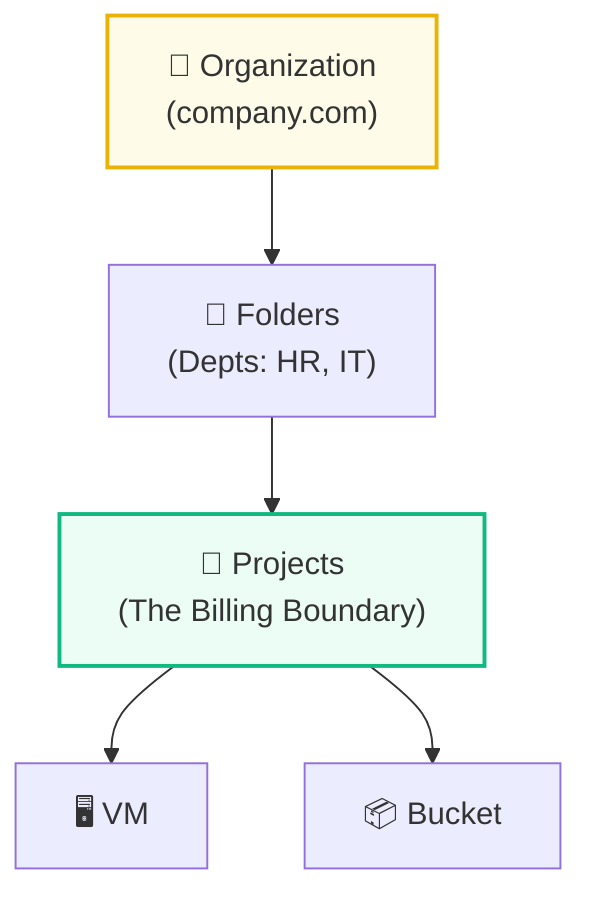
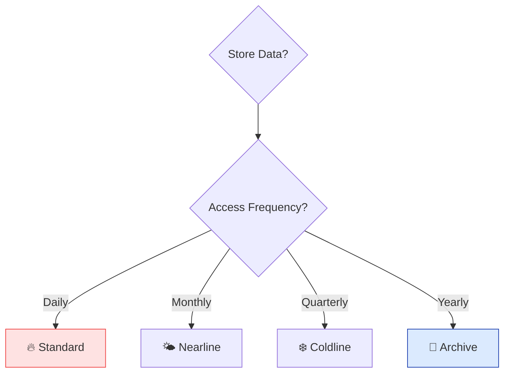

# Day 7: Week 1 Review & Exam Strategy

**Level:** Review  
**Milestone:** 🏁 Week 1 Complete!

---

## 🎯 1. Week 1 Recap: The Foundations

You have survived the first week of Google Cloud! You've gone from "What is the Cloud?" to deploying multi-zone web servers.

| Day | Topic | Key Takeaway |
| :--- | :--- | :--- |
| **1** | **Foundations** | Cloud = Renting resources. OpEx > CapEx. |
| **2** | **Hierarchy** | Org > Folder > Project. Policies flow DOWN. |
| **3** | **Compute** | IaaS. Use E2 for general work, C2 for compute. |
| **4** | **Storage** | GCS = Object Storage. Buckets must be globally unique. |
| **5** | **Disk** | PD (Safe/Network) vs Local SSD (Fast/Wipes on Stop). |
| **6** | **IAM** | Identity + Role. Always use Least Privilege. |

---

## 📊 2. Visual Recap: Decision Logic

### The Resource Hierarchy (Governance)


### Storage Decision Tree (Exam Gold)


---

## ⚠️ 3. Common Exam Traps

> [!IMPORTANT]
> **Trap #1: The Immutable Disk**
> You can **upsize** a Persistent Disk while the VM is running, but you can **never downsize** it. To shrink, you must create a new disk and copy data.

> [!TIP]
> **Trap #2: Global vs Regional**
> VPCs are **Global**. Subnets are **Regional**. Buckets are **Regional/Multi-Regional** but their *Names* are **Global**.

> [!CAUTION]
> **Trap #3: Role Inheritance**
> If you give a user "Storage Admin" at the Folder level, they can delete every bucket in every project within that folder. **Avoid primitive roles (Owner/Editor) whenever possible.**

---

## 🧪 4. Weekend Capstone Lab: Multi-Zone Web App

**Scenario:** Create a highly available web server across two zones using `gcloud`.

### ✅ Step 1: Network Prep
```bash
# Create the VPC
gcloud compute networks create week1-vpc --subnet-mode=custom

# Create a Subnet in your region
gcloud compute networks subnets create week1-subnet \
  --network=week1-vpc \
  --region=us-central1 \
  --range=10.0.1.0/24

# Allow HTTP Traffic (Port 80)
gcloud compute firewall-rules create allow-http \
  --network=week1-vpc \
  --allow=tcp:80 \
  --source-ranges=0.0.0.0/0 \
  --target-tags=web-server
```

### ✅ Step 2: Deploy HA Servers
```bash
# Create VM in Zone A
gcloud compute instances create web-vm-a \
  --zone=us-central1-a \
  --subnet=week1-subnet \
  --tags=web-server \
  --metadata=startup-script='#!/bin/bash
  apt-get update && apt-get install -y apache2
  echo "Hello from Zone A" > /var/www/html/index.html'

# Create VM in Zone B
gcloud compute instances create web-vm-b \
  --zone=us-central1-b \
  --subnet=week1-subnet \
  --tags=web-server \
  --metadata=startup-script='#!/bin/bash
  apt-get update && apt-get install -y apache2
  echo "Hello from Zone B" > /var/www/html/index.html'
```

### ✅ Step 3: Test & Clean Up
1. Get the External IP of both: `gcloud compute instances list`
2. Open them in a browser. 
3. **DELETE EVERYTHING** to save money:
```bash
gcloud compute instances delete web-vm-a web-vm-b --quiet
gcloud compute networks delete week1-vpc --quiet
```

---

## 🏆 5. What's Next? (Week 2 Preview)

Week 1 was about **Basics**. Week 2 is about **Management at Scale**.

*   **Managed Instance Groups (MIGs):** Auto-healing and auto-scaling.
*   **Load Balancing:** High-performance global distribution.
*   **Cloud SQL:** Letting Google manage your databases.
*   **Kubernetes (GKE):** The future of container management.

---

<div class="checklist-card" x-data="{ 
    items: [
        { text: 'I understand the Resource Hierarchy (Org > Folder > Project).', checked: false },
        { text: 'I know when to use Standard vs Archive storage.', checked: false },
        { text: 'I can launch a VM using the gcloud CLI.', checked: false },
        { text: 'I understand why Least Privilege is critical for IAM.', checked: false }
    ]
}">
    <h3>
        <svg viewBox="0 0 24 24" fill="none" stroke="currentColor" stroke-width="2" stroke-linecap="round" stroke-linejoin="round" width="24" height="24" class="text-blurple">
            <path d="M22 11.08V12a10 10 0 1 1-5.93-9.14"></path>
            <polyline points="22 4 12 14.01 9 11.01"></polyline>
        </svg>
        Week 1 Milestone Checklist
    </h3>
    <template x-for="(item, index) in items" :key="index">
        <div class="checklist-item" @click="item.checked = !item.checked">
            <div class="checklist-box" :class="{ 'checked': item.checked }">
                <svg viewBox="0 0 24 24" fill="none" stroke="currentColor" stroke-width="3" stroke-linecap="round" stroke-linejoin="round">
                    <polyline points="20 6 9 17 4 12"></polyline>
                </svg>
            </div>
            <span x-text="item.text" :class="{ 'line-through text-slate-400': item.checked }"></span>
        </div>
    </template>
</div>
