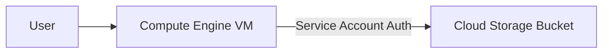

# SECTION 7: Week 1 - Comprehensive Review & Capstone

> **Goal**: Verify your mastery of Fundamentals, Compute, and Storage.

## 1️⃣ Week 1 Cheat Sheet 📝

| Concept | Definition | Exam Key |
| :--- | :--- | :--- |
| **OpEx vs CapEx** | Operational (Pay-as-you-go) vs Capital (Upfront). | Cloud is **OpEx**. |
| **Project ID** | `my-app-8821` | Globally unique. Immutable. |
| **Zone vs Region** | Zone = Building (`us-central1-a`). Region = City (`us-central1`). | Region has 3+ Zones. |
| **Live Migration** | Moving running VMs without downtime. | GCP Superpower (others reboot). |
| **Spot VM** | 90% Discount. 30s Warning. | Use for stateless batch jobs. |
| **MIG** | Managed Instance Group. | Auto-healing (recreates failed VMs). |
| **Standard PD** | Magnetic Hard Drive. | Backup / Cold data. |
| **Local SSD** | Ephemeral (Physical). | Fast Cache / Swap. Data dies on stop. |
| **Storage Class** | Standard ➔ Nearline ➔ Coldline ➔ Archive. | Use **Lifecycle Policies** to move them. |
| **Signed URL** | Temporary Key. | Secure object upload/download. |

---

## 2️⃣ The "Connector" Challenge Lab 🏆
**Scenario:** You need a Web Server (Day 2) that serves an image stored in a Private Bucket (Day 3).

### Architecture

### Steps
1.  **Create a Bucket:**
    *   Name: `my-secret-assets-[YOUR_NAME]`
    *   Upload an image `logo.png`.
    *   **Do NOT** make it public. (Keep it private!).
2.  **Create a VM:**
    *   Name: `connector-vm`
    *   **Identity and API Access:**
        *   Service Account: **Compute Engine Default Service Account**.
        *   Access Scopes: **Allow full access to all Cloud APIs** (easiest for lab).
3.  **SSH into VM:**
    *   Run: `gcloud storage cp gs://my-secret-assets-[YOUR_NAME]/logo.png .`
    *   *Result:* It downloads! Why? Because the VM's Service Account is authorized.
4.  **Verify:**
    *   Run `ls`. You see `logo.png`.
    *   You successfully connected Compute to Storage securely!

---

## 3️⃣ Week 1 Mock Exam 🧠
<form>
  <!-- Q1 -->
  

    
1. You have a photo sharing app. You need to store user uploads permanently. You must be able to retrieve them instantly, but 99% of photos are rarely accessed after 30 days. Which strategy is most cost-effective?

    

      <label class="block"><input type="radio" name="q1" value="wrong"> Store all in Standard class.</label>
      <label class="block"><input type="radio" name="q1" value="wrong"> Store all in Archive class.</label>
      <label class="block"><input type="radio" name="q1" value="correct"> Use Standard, then a Lifecycle Rule to move to Nearline/Coldline.</label>
      <label class="block"><input type="radio" name="q1" value="wrong"> Use Persistent Disks.</label>
    

    

      Correct! Lifecycle rules automate cost savings based on object age.
    

  

  <!-- Q2 -->
  

    
2. Which feature allows you to run a script *automatically* every time a VM creates or reboots?

    

      <label class="block"><input type="radio" name="q2" value="correct"> Startup Script</label>
      <label class="block"><input type="radio" name="q2" value="wrong"> Cloud Functions</label>
      <label class="block"><input type="radio" name="q2" value="wrong"> Cron Job</label>
      <label class="block"><input type="radio" name="q2" value="wrong"> Metadata Server</label>
    

    

      Correct! Startup scripts (in metadata) execute on boot.
    

  

  <!-- Q3 -->
  

    
3. You deleted a VM. You checked "Delete boot disk" when creating it. Is the data on the boot disk recoverable?

    

      <label class="block"><input type="radio" name="q3" value="wrong"> Yes, simple undelete operation.</label>
      <label class="block"><input type="radio" name="q3" value="wrong"> Yes, in the "Recycle Bin".</label>
      <label class="block"><input type="radio" name="q3" value="correct"> No, unless you took a Snapshot beforehand.</label>
    

    

      Correct! Deleting a disk is permanent. Snapshots are your only safety net.
    

  

  <!-- Q4 -->
  

    
4. A Global application needs to survive the failure of an entire Region (e.g. us-central1 goes offline). Where should you deploy?

    

      <label class="block"><input type="radio" name="q4" value="wrong"> Single Zone</label>
      <label class="block"><input type="radio" name="q4" value="wrong"> Regional (Multiple Zones)</label>
      <label class="block"><input type="radio" name="q4" value="correct"> Multi-Regional (Multiple Regions)</label>
      <label class="block"><input type="radio" name="q4" value="wrong"> Edge PoP</label>
    

    

      Correct! Only Multi-Region deployments survive regional failures.
    

  

</form>

---

### 🎓 Congratulations!
You have completed **Week 1** of the GCP Master Plan.
**Next Week:** We construct the piping of the cloud: **VPC Networking (Sections 8-12)**.
