# Week 1 Project: Hosting a Serverless Website

> **Objective**: By the end of this session, you will host a live, public website using Google Cloud Storage for pennies per month, without touching a single server.

## 🏗️ Architecture

```mermaid
graph LR
    User[🌍 User Browser] -- HTTP Request --> GCS[☁️ Google Cloud Storage Bucket]
    GCS -- Serves --> HTML[📄 index.html]
    GCS -- Serves --> JPG[🖼️ image.jpg]
    style GCS fill:#e8f0fe,stroke:#3b82f6,stroke-width:2px
```


## 🛠️ The Challenge
Your startup, "CloudCafe", needs a landing page. You have $0 budget for ops and hate managing Linux servers. You decide to use **Cloud Storage** as a web server.

### Prerequisites
- Active GCP Project
- Cloud Shell or Local Terminal with `gcloud` installed
- (Optional) A funny cat picture

---

## 🚀 Lab Steps

### Step 1: Create the Bucket
Buckets are global resources, so the name must be unique across *all* of Google Cloud.
1. Go to **Cloud Storage** > **Buckets**.
2. Click **Create**.
3. **Name**: `cloud-cafe-web-[YOUR_NAME]` (e.g., `cloud-cafe-web-jyothi-123`).
4. **Location**: Choose a `Region` near you (e.g., `us-central1`).
5. **Storage Class**: `Standard` (best for frequently accessed websites).
6. **Access Control**: Uncheck "Enforce public access prevention". **Crucial** for a website!
7. Click **Create**.

### Step 2: Create Your Website Files
Open a text editor (or Cloud Shell Editor) and create `index.html`:

```html
<!DOCTYPE html>
<html>
<head>
    <title>CloudCafe</title>
    <style>
        body { font-family: sans-serif; text-align: center; padding: 50px; background: #f0f9ff; }
        h1 { color: #0284c7; }
    </style>
</head>
<body>
    <h1>Welcome to CloudCafe ☕</h1>
    <p>Served 100% Serverless from Google Cloud Storage!</p>
</body>
</html>
```

Also create a simple `404.html`:
```html
<h1>404 - Coffee Spilled 😭</h1>
<p>Page not found.</p>
```

### Step 3: Upload Files
1. In the Bucket details page, click **Upload Files**.
2. Upload `index.html` and `404.html`.

### Step 4: Make it Public
By default, everything is private. We need to let the world see it.
1. Click the **Permissions** tab.
2. Click **Grant Access**.
3. **New Principals**: `allUsers` (This is a special identifier for "everyone on the internet").
4. **Role**: `Storage Object Viewer` (Read-only access).
5. Click **Save** > **Allow Public Access**.

> **⚠️ Security Warning**: Never do this for sensitive data! This is *only* for public websites.

### Step 5: Configure Website Mode
1. Go back to the **Configuration** tab (or check the overflow menu on the bucket list).
2. Look for **Edit Website Configuration**.
3. **Index page suffix**: `index.html`
4. **Error page**: `404.html`
5. Save.

### Step 6: Test It!
Your website is now live at a special URL:
`https://storage.googleapis.com/[YOUR_BUCKET_NAME]/index.html`

Or, simply click the "Public URL" link next to `index.html` in the file list.

---

## 🎯 Verification
If you can see your "CloudCafe" heading in a browser, you passed!

## 🧹 Tear Down
To stop incurring costs (though likely $0.00), delete the bucket when finished. 
`gcloud storage rm --recursive gs://[YOUR_BUCKET_NAME]`

---

## 📝 Week 1 Final Exam (Comprehensive)
**Q1. You are designing a global application for users in Japan, US, and Europe. You need a database that offers strong global consistency. Which CAP theorem attribute does GCP's Spanner prioritize to achieve this unique capability?**
*   A. Partition Tolerance only
*   B. Availability only
*   C. Consistency and Availability (CA) - effectively
*   D. Eventual Consistency
> **Answer: C.** Spanner delivers external consistency (Consistency) and high availability (Availability) using TrueTime.

**Q2. You have a "Dev" folder and a "Prod" folder. You want to ensure NO ONE can create a VM with an external IP address in the "Prod" folder. What do you use?**
*   A. IAM Role (Compute Admin)
*   B. VPC Firewall Rule
*   C. Organization Policy (Constraint)
*   D. Billing Alert
> **Answer: C.** Org Policies allow you to set strict guardrails on resources.

**Q3. Which resource scope involves resources that survive the failure of a single data center but not a whole region?**
*   A. Zonal
*   B. Regional
*   C. Multi-Regional
*   D. Global
> **Answer: B.** Regional resources are replicated across zones (data centers) within one region.

**Q4. Accessing your data in "Coldline" storage is cheaper than "Standard" storage, provided you access it less frequently than:**
*   A. Once a year
*   B. Once every 90 days
*   C. Once every 30 days
*   D. Once a day
> **Answer: B.** Coldline is optimized for 90-day access cycles.

**Q5. A startup wants to run a batch processing job that takes 4 hours. They want to save maximum money and can handle interruptions. Which VM type is best?**
*   A. On-Demand E2
*   B. Spot VM
*   C. Committed Use Discount (1 Year)
*   D. Shielded VM
> **Answer: B.** Spot VMs offer up to 91% discounts for fault-tolerant workloads.

**Q6. You attached a "Local SSD" to your database VM for high speed. You stop the instance to resize the CPU. What happens to the Local SSD data?**
*   A. It persists.
*   B. It is moved to a Persistent Disk.
*   C. It is lost (Ephemeral).
*   D. It is encrypted and saved.
> **Answer: C.** Local SSDs are physically attached and ephemeral. Stopping the VM wipes them.

**Q7. Which Identity tool is best for giving a "temporary" URL to a user to upload a file to Cloud Storage?**
*   A. Service Account Key
*   B. Signed URL
*   C. IAM User
*   D. Cloud Identity
> **Answer: B.** Signed URLs are time-limited and specific.

**Q8. What is the minimum number of zones in a standard GCP Region?**
*   A. 1
*   B. 2
*   C. 3
*   D. 5
> **Answer: C.** Most regions have 3 zones (a, b, c) for high availability.

**Q9. Who pays for the resources used by a Project?**
*   A. The Project Creator
*   B. The Organization Admin
*   C. The Linked Billing Account
*   D. Google
> **Answer: C.** Resources are billed to the Billing Account attached to the Project.

**Q10. Which Identifier is used by Terraform or CLI to uniquely identify your project?**
*   A. Project Name
*   B. Project ID
*   C. Project Number
*   D. Organization ID
> **Answer: B.** Project ID is the unique, immutable string used in code/CLI.

### 10️⃣ The "Drill Sergeant" Fundamentals Test 🪖
*If you cannot answer these 5 questions instantly, **Start Over**.*

**Q1. A startup is migrating a 10TB Oracle Database that requires 100,000 IOPS. They suggest using a "Standard Persistent Disk" to save money. Why will this fail and what is the fix?**
*   *Drill Answer:* Standard PDs are magnetic (HDD) and slow. They will choke on 100k IOPS. The fix is **Hyperdisk** or **Local SSD** (if ephemeral) or at minimum **Extreme PD**.

**Q2. Your CEO asks: "If we move to the cloud, why are we still paying for IT staff?" Explain TCO in one sentence.**
*   *Drill Answer:* "We trade **CapEx** (Hardware cost) for **OpEx** (Variable cost), and our IT staff moves from 'unboxing servers' to 'optimizing value'—lowering total TCO by removing physical maintenance."

**Q3. You created a VM in a new project. You try to SSH into it, but it fails. You discover the project has NO firewall rules. Why?**
*   *Drill Answer:* **Implicit Deny.** By default, ALL ingress traffic is blocked. You must create an `allow-ssh` rule.

**Q4. A bank requires that NO data ever exists unencrypted in RAM. What feature do you enable?**
*   *Drill Answer:* **Confidential VMs** (uses AMD SEV to encrypt memory).

**Q5. You accidentally deleted a production Folder. How long do you have to recover it?**
*   *Drill Answer:* **30 Days.** (Soft delete period).

---

## 📜 The "Core Fundamentals" Cheat Sheet
*(Print this mentally)*

| Concept | Definition | The "Gotcha" |
| :--- | :--- | :--- |
| **Project ID** | Unique Global ID | **Immutable** (Cannot change). |
| **Zone vs Region** | Zone = Building. Region = City. | **Disks are Zonal.** If Zone A dies, your disk is gone (unless snapshotted). |
| **Preemptible / Spot** | 91% Discount VM | **30-second warning** before death. |
| **Coldline Storage** | Cheap backup (90-day min) | **Retrieval Fee.** Don't use for frequently accessed data. |
| **IAM Policy** | Who (Identity) + What (Role) | **Deny** > **Allow.** (Actually, Organization Policies override IAM). |
| **VPC** | Global Software Network | **Subnets are Regional.** VPCs span the world. |
| **Hyperdisk** | Next-Gen Block Storage | **IOPS** are decoupled from **Size**. |

## 12️⃣ Certification Alignment 🎓
**Official Exam Mapping:**
*   This week covered **20%** of the Associate Cloud Engineer (ACE) Exam.
*   **Domain 1 (Setting Up):** Projects, Billing, IAM.
*   **Domain 2 (Planning):** Compute options, Storage classes.
*   *Next Week:* Networking (Domain 2 & 3).


<!-- FLASHCARDS
[
  {
    "term": "IaaS",
    "def": "Infrastructure as a Service (Compute Engine). You manage OS + App."
  },
  {
    "term": "PaaS",
    "def": "Platform as a Service (App Engine). You manage App only."
  },
  {
    "term": "SaaS",
    "def": "Software as a Service (Gmail, Drive). You manage nothing."
  },
  {
    "term": "OpEx",
    "def": "Operational Expenditure. Pay-as-you-go (Cloud Model)."
  },
  {
    "term": "CapEx",
    "def": "Capital Expenditure. Upfront hardware cost (On-Prem Model)."
  }
]
-->