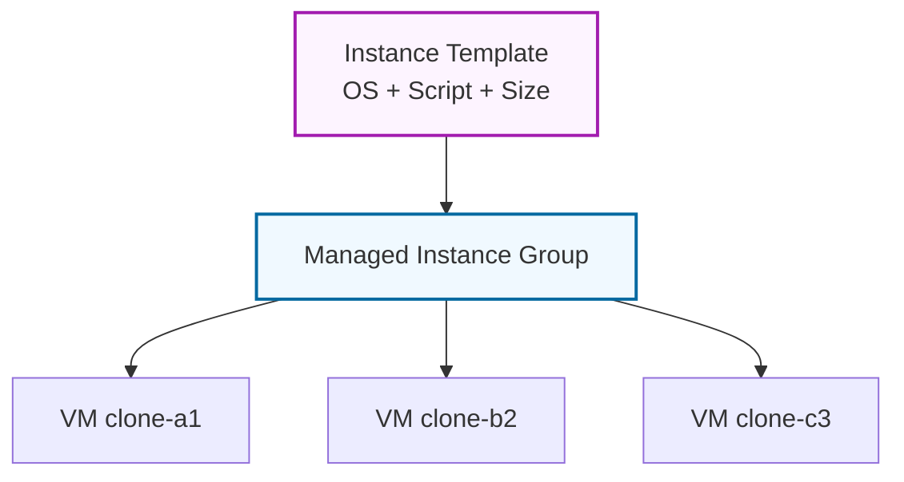
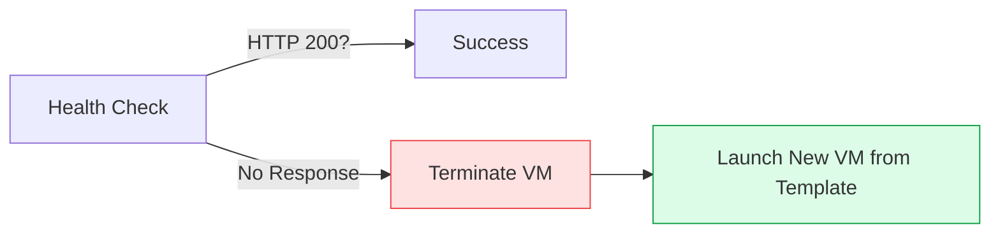

# Day 8: Instance Groups & Auto-healing

**Duration:** ⏱️ 45 Minutes  
**Level:** Intermediate  
**ACE Exam Weight:** ⭐⭐⭐⭐ High (Scaling concepts are frequent)

---

## 🎯 Learning Objectives

By the end of Day 8, you will be able to:
*   **Differentiate** between Unmanaged and Managed Instance Groups (MIGs).
*   **Configure** High Availability using Regional MIGs.
*   **Implement** Auto-healing to detect and replace unhealthy VMs.
*   **Master** the "Cattle vs. Pets" philosophy of cloud infrastructure.

---

## 🧠 1. What are Instance Groups?

An **Instance Group** is a collection of VM instances treated as a single entity. 

### The Two Types
1.  **Unmanaged Instance Groups:** A "bag of random VMs". Used for legacy applications where VMs are different. Avoid these for new projects.
2.  **Managed Instance Groups (MIGs):** All VMs are identical clones created from a **Template**.



---

## 💂 2. The Philosophy: Cattle vs. Pets

In the cloud, we don't name our servers "Bessie" and care for them when they are sick. We treat them like **Cattle**.

> [!IMPORTANT]
> **The Stateless Rule:**
> For a MIG to work, your application must be **Stateless**. This means no data is saved on the VM's local disk. All data goes to **Cloud SQL** or **Cloud Storage**.

| Feature | **Pets (Single VM)** | **Cattle (MIG)** |
| :--- | :--- | :--- |
| **Identity** | Fixed Name (e.g. `prod-db-1`) | Random Name (e.g. `web-a8f2`) |
| **Failure** | Manual repair needed. | Automatically replaced (**Auto-healing**). |
| **Scaling** | Vertical (Bigger VM). | Horizontal (More VMs). |

---

## 🏗️ 3. Auto-healing & Scaling Logic

MIGs don't just sit there; they actively monitor your application.

### Auto-healing Flow


> [!TIP]
> **Regional MIGs:** For maximum safety, create a **Regional MIG**. This spreads your VMs across 3 zones automatically. If an entire data center loses power, your app stays UP!

---

## 🛠️ 4. Hands-On Lab: Build a Self-Healing Cluster

**🧪 Lab Objective:** Create a group of web servers that automatically resurrects itself after a failure.

### ✅ Phase 1: The Blueprint (Instance Template)
1.  Go to **Compute Engine > Instance Templates**.
2.  Click **Create Instance Template**.
3.  **Name:** `web-server-base`.
4.  **Machine Type:** `e2-micro`.
5.  **Startup Script (Advanced > Management):**
    ```bash
    #! /bin/bash
    apt update && apt install -y apache2
    echo "Resurrected at $(date)" > /var/www/html/index.html
    ```

### ✅ Phase 2: The Army (Managed Instance Group)
1.  Go to **Compute Engine > Instance Groups**.
2.  Click **Create Instance Group**.
3.  Select **New Managed Instance Group (Stateless)**.
4.  Location: **Multiple Zones (Regional)**.
5.  Autoscaling: **Min 2, Max 5**.
6.  Metric: **CPU Utilization at 60%**.

### ✅ Phase 3: The Test
1.  Navigate to **VM Instances**.
2.  **Delete** one of the instances in the group.
3.  Watch the Group manager spin up a replacement within 60 seconds.

---

## 📝 5. Checkpoint Quiz

1.  **Which feature of a MIG ensures that a VM is replaced if the application running on it crashes?**
    *   A. Auto-scaling
    *   B. **Auto-healing** ✅
    *   C. Rolling Updates
    *   D. Load Balancing

2.  **You need to ensure your application can survive the total failure of a GCP Region. Can a single MIG do this?**
    *   *Answer:* **No.** A MIG is Regional at most. To survive a Region failure, you need MIGs in **two different regions** behind a Global Load Balancer.

3.  **True or False: To update the OS on 100 VMs in a MIG, you must delete the MIG and start over.**
    *   *Answer:* **False.** You update the **Instance Template** and perform a **Rolling Update**.

---

<div class="checklist-card" x-data="{ 
    items: [
        { text: 'I understand the Cattle vs Pets analogy.', checked: false },
        { text: 'I can explain the difference between a Zonal and Regional MIG.', checked: false },
        { text: 'I created an Instance Template with a startup script.', checked: false },
        { text: 'I observed Auto-healing in action after deleting a VM.', checked: false }
    ]
}">
    <h3>
        <svg viewBox="0 0 24 24" fill="none" stroke="currentColor" stroke-width="2" stroke-linecap="round" stroke-linejoin="round" width="24" height="24" class="text-blurple">
            <path d="M22 11.08V12a10 10 0 1 1-5.93-9.14"></path>
            <polyline points="22 4 12 14.01 9 11.01"></polyline>
        </svg>
        Day 8 Checklist
    </h3>
    <template x-for="(item, index) in items" :key="index">
        <div class="checklist-item" @click="item.checked = !item.checked">
            <div class="checklist-box" :class="{ 'checked': item.checked }">
                <svg viewBox="0 0 24 24" fill="none" stroke="currentColor" stroke-width="3" stroke-linecap="round" stroke-linejoin="round">
                    <polyline points="20 6 9 17 4 12"></polyline>
                </svg>
            </div>
            <span x-text="item.text" :class="{ 'line-through text-slate-400': item.checked }"></span>
        </div>
    </template>
</div>
