# Day 8: Instance Groups & Auto-Scaling

**Duration:** ⏱️ 60 Minutes  
**Level:** Intermediate  
**ACE Exam Weight:** ⭐⭐⭐⭐⭐ Critical (Scaling is heavily tested)

---

## 🎯 Learning Objectives

By the end of Day 8, you will be able to:

*   **Differentiate** between Unmanaged and Managed Instance Groups
*   **Configure** Zonal vs Regional MIGs for high availability
*   **Implement** auto-scaling based on CPU, LB, or custom metrics
*   **Enable** auto-healing to detect and replace unhealthy VMs
*   **Apply** the "Cattle vs Pets" philosophy

---

## 🏢 Industry Context: Auto-Scaling in Production

> [!NOTE]
> **Role Lens:** MIGs are the foundation of production deployments. Every Cloud Engineer must master this.

### Job Roles & MIG Usage

| Role | How They Use MIGs | Day-to-Day Tasks |
|------|------------------|------------------|
| **Cloud Engineer** | Deploy production workloads | Creating MIGs, configuring scaling |
| **DevOps Engineer** | Automate infrastructure | Instance templates, rolling updates |
| **SRE** | Ensure reliability | Health checks, auto-healing configs |
| **Platform Engineer** | Standardize deployments | Template management, policies |

### Production Patterns

| Pattern | Architecture | When to Use |
|---------|--------------|-------------|
| **Regional MIG + LB** | 3-zone MIG behind Global LB | Production web apps |
| **Scheduled Scaling** | Scale up before traffic peak | Predictable load patterns |
| **Custom Metrics** | Scale on queue depth | Job processing systems |

### ❌ Interview Mistakes to Avoid

| Mistake | Why It's Bad | What to Say Instead |
|---------|--------------|---------------------|
| "I use Zonal MIG for production" | Single zone = single point of failure | "I use Regional MIG for zone redundancy" |
| "I store session data on VM disk" | Data lost when VM is replaced | "I use external state: Cloud SQL, Redis" |
| "I don't set initial delay for health checks" | VMs fail before app starts | "I set initial delay to allow boot time" |

---

## 🧠 1. What Are Instance Groups? (Plain-English)

**Instance Group = Collection of VMs treated as one unit.**

### Types of Instance Groups

| Type | Description | Use Case |
|------|-------------|----------|
| **Unmanaged** | Bag of different VMs | Legacy apps, heterogeneous VMs |
| **Managed (MIG)** | Identical VMs from a template | Production, auto-scaling |

### 💡 Real-World Analogy: Army vs Mercenaries

| Unmanaged | Managed Instance Group |
|-----------|------------------------|
| Mercenaries: different skills, different equipment | Army: identical training, identical gear |
| Hard to replace | Easy to replace |
| Manual management | Automated management |

---

## 🏗️ 2. Managed Instance Group Architecture


### MIG Types

| Type | Zones | Availability | Use Case |
|------|-------|--------------|----------|
| **Zonal MIG** | 1 zone | Low | Dev/test, cost savings |
| **Regional MIG** | 3 zones | High | Production workloads |

> **🎯 ACE Tip:** Always choose **Regional MIG** for production to survive zone failures.

---

## 🐄 3. Cattle vs Pets Philosophy

In the cloud, VMs are **cattle**, not **pets**.

### The Philosophy

| Aspect | Pets (Old Way) | Cattle (Cloud Way) |
|--------|---------------|-------------------|
| **Naming** | prod-db-server-1 | vm-a8f2c3d1 |
| **Failure** | Panic! Fix manually | Shrug. Auto-replace. |
| **Scaling** | Buy bigger server | Add more servers |
| **State** | On VM disk | In Cloud SQL/Storage |

### The Stateless Requirement

```mermaid
flowchart LR
    subgraph Wrong["❌ Stateful (Don't)"]
        VM1[VM] --> DISK[Local Disk]
    end
    
    subgraph Right["✅ Stateless (Do)"]
        VM2[VM] --> SQL[Cloud SQL]
        VM2 --> GCS[Cloud Storage]
    end
    
    style Wrong fill:#ffebee,stroke:#f44336
    style Right fill:#e8f5e9,stroke:#4caf50
```



> **🎯 ACE Tip:** If your app stores data locally, MIG cannot auto-heal properly. Always use external storage!

---

## ⚡ 4. Auto-Scaling Deep Dive

### Scaling Triggers

| Metric | Description | Best For |
|--------|-------------|----------|
| **CPU Utilization** | Scale when CPU > threshold | Most workloads |
| **Load Balancer Capacity** | Scale based on LB requests | Web apps |
| **Cloud Monitoring Metric** | Custom metrics | Custom apps |
| **Schedule** | Time-based scaling | Predictable traffic |

### Scaling Configuration


### gcloud Commands
```bash
# Create autoscaler
gcloud compute instance-groups managed set-autoscaling my-mig \
    --zone=us-central1-a \
    --min-num-replicas=2 \
    --max-num-replicas=10 \
    --target-cpu-utilization=0.6 \
    --cool-down-period=60
```

---

## 🏥 5. Auto-Healing

Auto-healing automatically replaces unhealthy VMs.

### How It Works


### Health Check Configuration

| Setting | Recommended | Description |
|---------|-------------|-------------|
| **Check Interval** | 10 seconds | How often to check |
| **Timeout** | 5 seconds | Wait time for response |
| **Unhealthy Threshold** | 3 | Failures before action |
| **Healthy Threshold** | 2 | Successes to recover |

---

## 🛠️ 6. Hands-On Lab: Self-Healing Cluster

### Step 1: Create Instance Template
```bash
gcloud compute instance-templates create web-template \
    --machine-type=e2-micro \
    --tags=http-server \
    --metadata=startup-script='#!/bin/bash
apt-get update && apt-get install -y apache2
echo "Healthy at $(date)" > /var/www/html/index.html
echo "OK" > /var/www/html/health'
```

### Step 2: Create Regional MIG
```bash
gcloud compute instance-groups managed create web-mig \
    --template=web-template \
    --size=2 \
    --region=us-central1 \
    --zones=us-central1-a,us-central1-b,us-central1-c
```

### Step 3: Create Health Check
```bash
gcloud compute health-checks create http web-health-check \
    --port=80 \
    --request-path=/health
```

### Step 4: Enable Auto-healing
```bash
gcloud compute instance-groups managed update web-mig \
    --region=us-central1 \
    --health-check=web-health-check \
    --initial-delay=60
```

### Step 5: Configure Auto-scaling
```bash
gcloud compute instance-groups managed set-autoscaling web-mig \
    --region=us-central1 \
    --min-num-replicas=2 \
    --max-num-replicas=5 \
    --target-cpu-utilization=0.6
```

### Step 6: Test Auto-healing
```bash
# List instances
gcloud compute instances list --filter="name~web-mig"

# Delete one instance and watch it recreate
gcloud compute instances delete <instance-name> --zone=us-central1-a --quiet

# Watch the MIG recreate it
watch gcloud compute instances list --filter="name~web-mig"
```

---

## ⚠️ 7. Exam Traps & Pro Tips

### ❌ Common Mistakes
| Mistake | Reality |
|---------|---------|
| "MIG can survive region failure" | No! MIG is regional at most. Need multi-region with Global LB. |
| "Auto-healing = Auto-scaling" | No! Healing replaces sick VMs. Scaling adds/removes VMs. |
| "Rolling updates need downtime" | No! Rolling updates replace VMs gradually. |

### ✅ Pro Tips
*   **Always use Regional MIGs** for production
*   **Set initial delay** for auto-healing to allow boot time
*   **Use health checks** that test actual application health
*   **Update templates** and do rolling updates (don't destroy MIG)

---

<!-- QUIZ_START -->
## 📝 8. Knowledge Check Quiz

1. **Which MIG feature ensures a VM is replaced if the application crashes?**
    *   A. Auto-scaling
    *   B. **Auto-healing** ✅
    *   C. Rolling Updates
    *   D. Load Balancing

2. **Your app must survive a complete zone failure. What should you create?**
    *   A. Zonal MIG
    *   B. **Regional MIG** ✅
    *   C. Unmanaged Instance Group
    *   D. Single VM with Spot pricing

3. **To update the OS on 100 VMs in a MIG, you should:**
    *   A. Delete and recreate the MIG
    *   B. SSH into each VM manually
    *   C. **Update the template and do a rolling update** ✅
    *   D. Stop all VMs and upgrade

4. **Which scaling metric is best for a web application behind a load balancer?**
    *   A. Memory utilization
    *   B. Disk I/O
    *   C. **Load Balancer capacity** ✅
    *   D. Network bandwidth

5. **Your MIG VMs store user sessions on local disk. What's the problem?**
    *   A. Higher cost
    *   B. **Data loss when auto-healing replaces VMs** ✅
    *   C. Slower performance
    *   D. No external IP
<!-- QUIZ_END -->

---

## ✅ Day 8 Checklist

- [ ] Understand Cattle vs Pets philosophy
- [ ] Create an instance template with startup script
- [ ] Create a Regional MIG
- [ ] Configure auto-scaling and auto-healing
- [ ] Test auto-healing by deleting an instance

---

<!-- FLASHCARDS
[
  {"term": "MIG", "def": "Managed Instance Group. Identical VMs from a template with auto-scaling and auto-healing."},
  {"term": "Instance Template", "def": "Blueprint for creating identical VMs. Defines machine type, image, and scripts."},
  {"term": "Auto-healing", "def": "Automatically replaces unhealthy VMs based on health check failures."},
  {"term": "Auto-scaling", "def": "Automatically adds/removes VMs based on load metrics (CPU, LB, custom)."},
  {"term": "Regional MIG", "def": "MIG spread across 3 zones. Survives single zone failure."},
  {"term": "Cattle vs Pets", "def": "Treat VMs as disposable (cattle) not precious (pets). Store state externally."}
]
-->

---

### 🗑️ Lab Cleanup (Mandatory)

> **⚠️ Critical:** Delete resources to avoid unecessary billing!

1.  **Delete Project:** (Fastest way)
    ```bash
    gcloud projects delete $PROJECT_ID
    ```
2.  **Or Delete Resources Individually:**
    ```bash
    # Example commands (verify before running)
    gcloud compute instances delete [INSTANCE_NAME] --quiet
    gcloud storage rm -r gs://[BUCKET_NAME]
    ```
