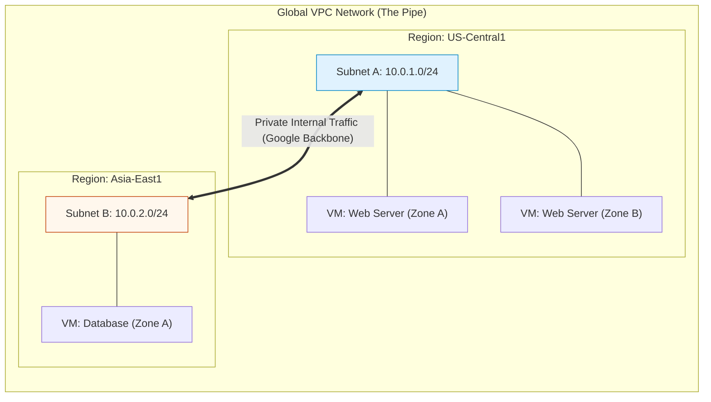

# SECTION 7: VPC Networking Basics

> **Official Doc Reference**: [VPC Documentation](https://cloud.google.com/vpc/docs)

## 1️⃣ Overview: The "Global" Difference
Google Cloud's Virtual Private Cloud (VPC) is fundamentally different from AWS or Azure.
*   **The Difference:** In AWS, a VPC is **Regional** (locked to Virginia or Ohio). In GCP, a VPC is **Global**.
*   **The Superpower:** You can have a VM in Tokyo talk to a VM in New York over a **private IP** (e.g., `10.0.1.5` talking to `10.0.2.5`) without setting up a single VPN or Gateway. It just works.

### Comparison Table
| Feature | Google Cloud VPC | AWS VPC / Azure VNet |
| :--- | :--- | :--- |
| **Scope** | **Global** (Spans the world) | **Regional** (Locked to one region) |
| **Routing** | Automatic global routing | Requires Peering/Gateways for cross-region |
| **Subnets** | **Regional** | **Zonal** (AWS) / Regional (Azure) |

## 2️⃣ Core Object Hierarchy (Deep Dive)
*   **VPC (Network)**: The global container.
    *   *Auto-Mode:* Good for demos. Creates a subnet in every single GCP region. Waste of IP space.
    *   *Custom-Mode:* **Enterprise Standard**. Starts empty. You create subnets only where you need them.
*   **Subnet**: A regional partition of the IP space.
    *   *Scope:* **Regional**. (A subnet covers all zones `a,b,c` in a region).
    *   *Expandable:* You can expand IPs without downtime. (e.g., `/24` -> `/20`).
    *   *Shrinkable?* **No.** Measure twice, cut once.

### Visual Hierarchy


## 3️⃣ Firewall Rules (The "Implied Deny")
GCP Firewalls are **Stateful**.
*   **Meaning:** If you allow a request OUT (e.g., download a patch), the reply is automatically allowed IN. You don't need a return rule.
*   **The Default:**
    *   **Ingress (Incoming):** **DENY ALL**. (Nothing gets in).
    *   **Egress (Outgoing):** **ALLOW ALL**. (Your servers can talk to the internet).

### 💡 Pro Tip: Identity-Based Firewalls
Stop using IP addresses for firewalls!
*   *Bad Way:* "Allow 10.0.1.5 to talk to 10.0.2.5". (IPs change).
*   *Good Way:* "Allow tag `web-server` to talk to tag `database`".
*   *Best Way:* "Allow Service Account `web-app@...` to talk to Service Account `db-engine@...`".

## 4️⃣ Connectivity Options (Exam Gold 🥇)

### A. VPC Peering (Decentralized)
*   **Use Case:** Two different companies (SaaS Provider + Client) need to connect privately.
*   **Mechanism:** Connects two VPCs.
*   **Constraint:** **Non-Transitive**. If A peers with B, and B peers with C, A CANNOT reach C. A must peer with C directly.

### B. Shared VPC (Centralized)
*   **Use Case:** One large company with separate teams (Networking Team vs Application Team).
*   **Mechanism:**
    *   **Host Project:** Owned by Network Team. Contains the VPC and Subnets.
    *   **Service Project:** Owned by App Team. They attach their VMs to the Host Project's subnets.
    *   *Benefit:* Separation of Duties. App team creates VMs, but Network team controls the IPs and Firewalls.

## 5️⃣ Hands-On: creating a Custom VPC 🛠️
```bash
# 1. Create the Custom VPC (Starts empty)
gcloud compute networks create my-enterprise-vpc --subnet-mode=custom

# 2. Create a Subnet in US (Specific Range)
gcloud compute networks subnets create us-core-subnet \
    --network=my-enterprise-vpc \
    --region=us-central1 \
    --range=10.0.1.0/24

# 3. Create a Firewall Rule (Targeting a TAG)
gcloud compute firewall-rules create allow-web-traffic \
    --network=my-enterprise-vpc \
    --allow=tcp:80,tcp:443 \
    --target-tags=web-server
```

## 6️⃣ Checkpoint Questions (Exam Style)
**Q1. A global company wants to connect their US, EU, and Asia offices. They want to minimize VPN setup complexity. Which cloud provider offers a single Global VPC that natively routes distinct regions?**
*   A. AWS
*   B. Azure
*   C. Google Cloud
*   D. Oracle Cloud
> **Answer: C.** GCP VPCs are global by default.

**Q2. You have 3 VPCs: A, B, and C. A is peered with B. B is peered with C. Can A talk to C?**
*   A. Yes, peering is transitive.
*   B. No, peering is non-transitive.
*   C. Only if B acts as a NAT gateway.
*   D. Only if using Shared VPC.
> **Answer: B.** Peering is non-transitive. A and C must peer directly.

**Q3. Which Firewall rule target is considered the most secure and manageable for long-term operations?**
*   A. Target IP Ranges
*   B. Target Tags
*   C. Target Service Accounts
*   D. Target Zone
> **Answer: C.** Service Accounts provide cryptographically verifiable identity, unlike Tags which can be edited by anyone with instance-edit permissions.

**Q4. You need to assign IP ranges to different departments but keep centralized control over firewall security. Which architecture fits best?**
*   A. VPC Peering
*   B. Shared VPC
*   C. Cloud VPN
*   D. Multiple Projects with public IPs
> **Answer: B.** Shared VPC allows centralized network administration with decentralized resource creation.


<!-- FLASHCARDS
[
  {
    "term": "VPC",
    "def": "Virtual Private Cloud. Your private network in Google's cloud."
  },
  {
    "term": "subnet",
    "def": "A regional subdivision of a VPC (e.g., 10.0.1.0/24 in us-central1)."
  },
  {
    "term": "Global VPC",
    "def": "GCP VPCs are global resources, spanning all regions. Subnets are regional."
  },
  {
    "term": "Firewall Rule",
    "def": "Controls traffic to/from VM instances based on IP/Port/Tag."
  },
  {
    "term": "Internal IP",
    "def": "Private IP for communication inside the VPC."
  }
]
-->
