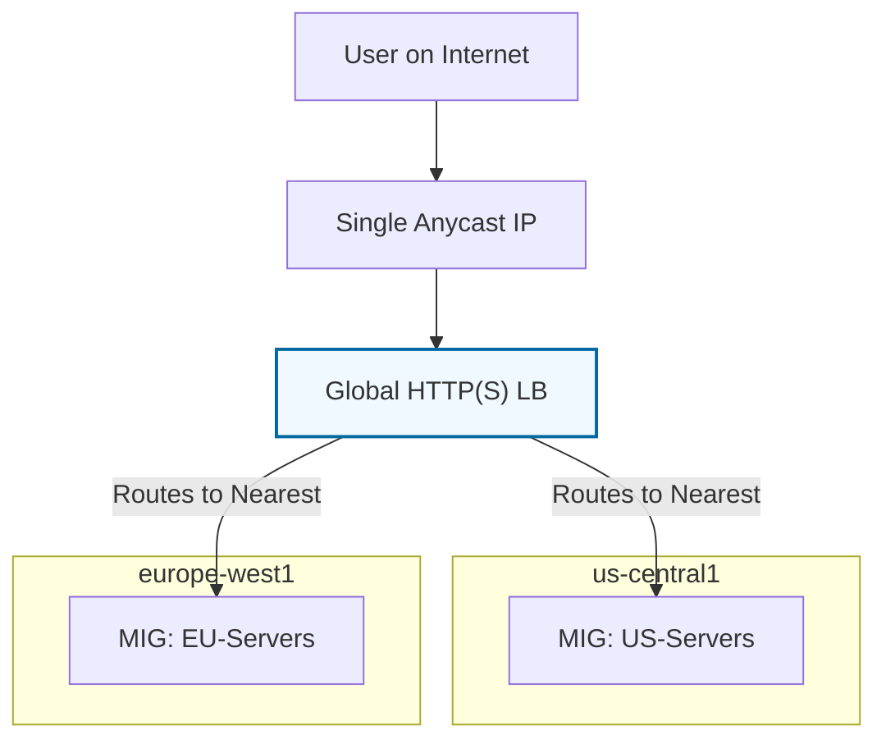

# Day 9: Cloud Load Balancing

**Duration:** ⏱️ 45 Minutes  
**Level:** Intermediate  
**ACE Exam Weight:** ⭐⭐⭐⭐⭐ Critical (ACE Core Service)

---

## 🎯 Learning Objectives

By the end of Day 9, you will be able to:
*   **Understand** the difference between Layer 4 (Network) and Layer 7 (Application) load balancing.
*   **Explain** how Anycast IPs allow for a single global endpoint.
*   **Distinguish** between External and Internal Load Balancers.
*   **Construct** a Global HTTP(S) Load Balancer for a web cluster.

---

## 🧠 1. What is Cloud Load Balancing?

If you have 10,000 users and only 1 Web Server, that server will crash. If you have 10 Web Servers, how do you decide which user goes where? 

**The answer is the Load Balancer (LB).**

### Key Feature: Anycast IP
Google's Global Load Balancers use a single **Anycast IP**. This means user traffic is routed to the nearest Google data center automatically. You don't need different IPs for US, Europe, and Asia!

---

## 🏗️ 2. The Decision Matrix: Choose Your LB

Google Cloud offers several types of Load Balancers. Choosing the wrong one is a frequent "Exam Trap".

| Load Balancer Type | Layer | Reach | Use Case |
| :--- | :--- | :--- | :--- |
| **Global HTTP(S)** | Layer 7 | **Global** | Web Apps, Mobile Backends, Content Delivery. |
| **Regional Network** | Layer 4 | Regional | Gaming, TCP/UDP traffic, Non-HTTP. |
| **Internal HTTP(S)** | Layer 7 | Regional | Private microservices talking to each other. |

---

## 👮 3. The Analogy: The Traffic Cop

Imagine a massive concert with 4 entrance gates.
*   The **Load Balancer** is the **Traffic Cop** at the front.
*   He sees Gate 1 is crowded, so he points the next 10 people to Gate 2.
*   If Gate 3 is closed (Server Crash), he puts up a sign so nobody tries to enter there (**Health Checks**).

> [!NOTE]
> **Health Checks:** A Load Balancer only sends traffic to "Healthy" instances. If your server stops responding to a "ping", the LB stops sending users there until it recovers.

---

## 🛠️ 4. Hands-On Lab: Putting it All Together

**🧪 Lab Objective:** Create a Global HTTP Load Balancer for your MIG from Day 8.

### ✅ Step 1: Frontend Configuration
1.  Go to **Network Services > Load Balancing**.
2.  Start "Create Load Balancer" > **Application Load Balancer (HTTP/S)**.
3.  Choose **Global** deployment.
4.  Frontend: Protocol **HTTP**, Port **80**.

### ✅ Step 2: Backend Configuration
1.  Create a **Backend Service**.
2.  Backend Type: **Instance Group**.
3.  Select your `web-server-base` MIG.
4.  **Health Check:** Create a new one. Protocol: **TCP**, Port: **80**.

> [!CAUTION]
> **Propagation Time:** Unlike local hardware, Global LBs can take **5-10 minutes** to start working. If you see a `404` or `502` error immediately, just wait!

---

## 📝 5. Checkpoint Quiz

1.  **Which Load Balancer would you use to support a global mobile application that uses a single IP address worldwide?**
    *   A. Regional Network LB
    *   B. **Global External HTTP(S) LB** ✅
    *   C. Internal TCP LB

2.  **At which layer of the OSI model does a Network Load Balancer operate?**
    *   A. Layer 7 (Application)
    *   B. **Layer 4 (Transport)** ✅
    *   C. Layer 3 (Network)

3.  **True or False: A Load Balancer can perform SSL termination, offloading the decryption work from your backend VMs.**
    *   *Answer:* **True.** This is a major benefit of using an HTTP(S) Load Balancer.

---

    <h3>
        <svg viewBox="0 0 24 24" fill="none" stroke="currentColor" stroke-width="2" stroke-linecap="round" stroke-linejoin="round" width="24" height="24" class="text-blurple">
            <path d="M22 11.08V12a10 10 0 1 1-5.93-9.14"></path>
            <polyline points="22 4 12 14.01 9 11.01"></polyline>
        </svg>
        Day 9 Checklist
    </h3>
    <template x-for="(item, index) in items" :key="index">
        

            

                <svg viewBox="0 0 24 24" fill="none" stroke="currentColor" stroke-width="3" stroke-linecap="round" stroke-linejoin="round">
                    <polyline points="20 6 9 17 4 12"></polyline>
                </svg>
            

            
        

    </template>

