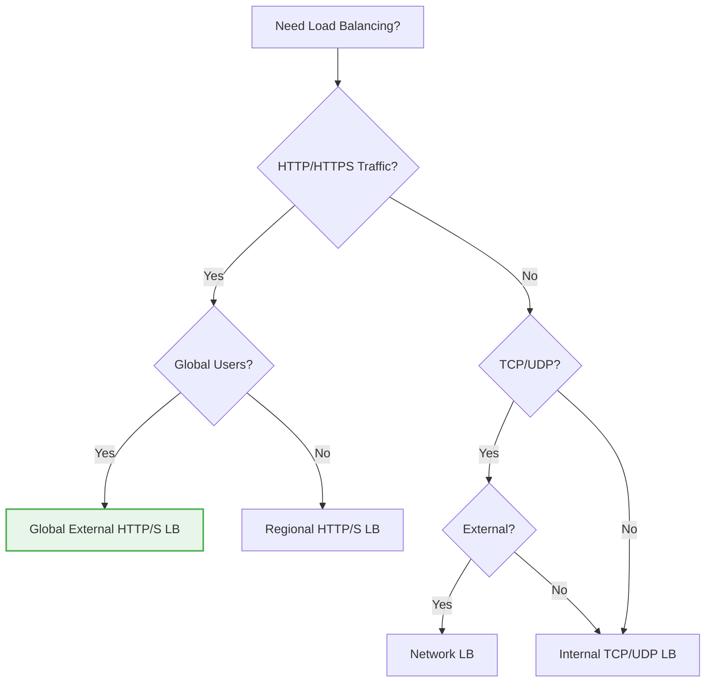
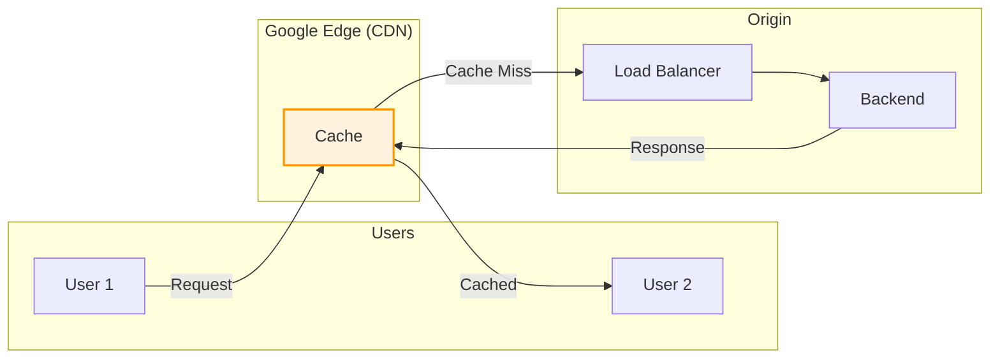

# Day 9: Cloud Load Balancing & CDN

**Duration:** ⏱️ 60 Minutes  
**Level:** Intermediate  
**ACE Exam Weight:** ⭐⭐⭐⭐⭐ Critical (Load Balancing is heavily tested)

---

## 🎯 Learning Objectives

By the end of Day 9, you will be able to:

*   **Understand** Layer 4 vs Layer 7 load balancing
*   **Explain** how Anycast IPs provide global routing
*   **Choose** the right load balancer for each scenario
*   **Configure** Cloud CDN for content caching
*   **Implement** SSL termination and health checks

---

## 🧠 1. Why Load Balancing? (Plain-English)

**Problem:** You have 10,000 users but only 1 web server → it crashes.  
**Solution:** Use 10 servers and a Load Balancer to distribute traffic.

### 💡 Real-World Analogy: Airport Check-In

| LB Concept | Airport Analogy |
|------------|-----------------|
| **Load Balancer** | Check-in counter manager |
| **Backend Servers** | Individual check-in counters |
| **Health Check** | "Counter Open/Closed" sign |
| **Anycast IP** | Single airport entrance that routes to nearest terminal |

---

## 🏗️ 2. GCP Load Balancer Types

### The Decision Matrix



### Complete LB Comparison

| Load Balancer | Layer | Scope | Use Case |
|--------------|-------|-------|----------|
| **Global External HTTP(S)** | L7 | Global | Web apps, APIs, mobile backends |
| **Global External TCP/SSL** | L4 | Global | Non-HTTP TCP (gaming, IoT) |
| **Regional External HTTP(S)** | L7 | Regional | Compliance (data must stay in region) |
| **Regional External Network** | L4 | Regional | UDP, non-HTTP protocols |
| **Internal HTTP(S)** | L7 | Regional | Private microservices |
| **Internal TCP/UDP** | L4 | Regional | Internal databases, apps |

> **🎯 ACE Tip:** If the question says "global" and "web app" → **Global HTTP(S) LB**. If it says "gaming" or "UDP" → **Network LB**.

---

## 🌍 3. Anycast IP: The Magic of Global Load Balancing

### How Anycast Works


**Key Benefits:**
*   Single IP address for global reach
*   Automatic routing to nearest healthy backend
*   No DNS changes needed for failover

---

## 🔒 4. SSL Termination & Certificates

### SSL Offloading Architecture


**Benefits:**
*   Offload CPU-intensive SSL from backend VMs
*   Centralized certificate management
*   Use Google-managed certificates (auto-renewing)

---

## 🚀 5. Cloud CDN (Content Delivery Network)

### How CDN Caching Works



### CDN Cache Control Headers
```
Cache-Control: max-age=3600  # Cache for 1 hour
Cache-Control: public        # Cacheable by CDN
Cache-Control: no-cache      # Must revalidate
Cache-Control: private       # Don't cache in CDN
```

---

## 🛠️ 6. Hands-On Lab: Create Global HTTP(S) LB

### Step 1: Create Instance Template
```bash
gcloud compute instance-templates create web-template \
    --machine-type=e2-micro \
    --tags=http-server \
    --metadata=startup-script='#!/bin/bash
apt-get update && apt-get install -y nginx
echo "<h1>Hello from $(hostname)</h1>" > /var/www/html/index.html'
```

### Step 2: Create Managed Instance Groups
```bash
# US region
gcloud compute instance-groups managed create mig-us \
    --template=web-template \
    --size=2 \
    --zone=us-central1-a

# EU region  
gcloud compute instance-groups managed create mig-eu \
    --template=web-template \
    --size=2 \
    --zone=europe-west1-b
```

### Step 3: Create Health Check
```bash
gcloud compute health-checks create http http-health-check \
    --port=80 \
    --request-path=/
```

### Step 4: Create Backend Service
```bash
gcloud compute backend-services create web-backend \
    --protocol=HTTP \
    --health-checks=http-health-check \
    --global

gcloud compute backend-services add-backend web-backend \
    --instance-group=mig-us \
    --instance-group-zone=us-central1-a \
    --global

gcloud compute backend-services add-backend web-backend \
    --instance-group=mig-eu \
    --instance-group-zone=europe-west1-b \
    --global
```

### Step 5: Create URL Map and Frontend
```bash
# URL map
gcloud compute url-maps create web-map \
    --default-service=web-backend

# HTTP proxy
gcloud compute target-http-proxies create http-proxy \
    --url-map=web-map

# Global forwarding rule (gets Anycast IP)
gcloud compute forwarding-rules create http-rule \
    --global \
    --target-http-proxy=http-proxy \
    --ports=80
```

### Step 6: Test
```bash
# Get the external IP
gcloud compute forwarding-rules describe http-rule --global --format="value(IPAddress)"

# Wait 5-10 minutes for propagation, then curl
curl http://YOUR_IP
```

---

## ⚠️ 7. Exam Traps & Pro Tips

### ❌ Common Mistakes
| Mistake | Reality |
|---------|---------|
| "Network LB is for web apps" | No! Network LB is for non-HTTP (Layer 4) |
| "Health checks are optional" | No! LB can't function properly without them |
| "LB starts working immediately" | No! Global LB takes 5-10 minutes |

### ✅ Pro Tips
*   **Use Google-managed SSL certificates** - auto-renewing, free
*   **Enable Cloud CDN** on static content for 50-90% latency reduction
*   **Use named ports** in instance groups for flexibility
*   **Set appropriate health check intervals** (not too aggressive)

---

<!-- QUIZ_START -->
## 📝 8. Knowledge Check Quiz

1. **Which Load Balancer would you use for a global mobile app with a single IP address?**
    *   A. Regional Network LB
    *   B. **Global External HTTP(S) LB** ✅
    *   C. Internal TCP LB
    *   D. Regional HTTP(S) LB

2. **At which OSI layer does a Network Load Balancer operate?**
    *   A. Layer 7 (Application)
    *   B. **Layer 4 (Transport)** ✅
    *   C. Layer 3 (Network)
    *   D. Layer 2 (Data Link)

3. **What does SSL termination at the Load Balancer provide?**
    *   A. End-to-end encryption
    *   B. **Offloads SSL decryption from backend VMs** ✅
    *   C. Automatic firewall rules
    *   D. DDoS protection only

4. **You need to cache static images globally to reduce latency. What should you enable?**
    *   A. VPC Peering
    *   B. Cloud Armor
    *   C. **Cloud CDN** ✅
    *   D. Cloud NAT

5. **How long should you wait for a Global HTTP(S) LB to start working after creation?**
    *   A. Instant
    *   B. 1 minute
    *   C. **5-10 minutes** ✅
    *   D. 1 hour
<!-- QUIZ_END -->

---

## ✅ Day 9 Checklist

- [ ] Understand Layer 4 vs Layer 7 differences
- [ ] Know which LB type for each scenario
- [ ] Configure health checks
- [ ] Set up Cloud CDN for caching
- [ ] Complete the hands-on lab

---

<!-- FLASHCARDS
[
  {"term": "Anycast IP", "def": "Single IP that routes users to the nearest Google edge location automatically."},
  {"term": "Layer 7 LB", "def": "Application layer. Can inspect HTTP headers, URLs, cookies for routing."},
  {"term": "Layer 4 LB", "def": "Transport layer. Routes based on IP/port only. For TCP/UDP."},
  {"term": "Health Check", "def": "Periodic probe to verify backend is healthy. Unhealthy = no traffic."},
  {"term": "SSL Termination", "def": "Decrypting HTTPS at the LB, sending HTTP to backends. Reduces backend CPU."},
  {"term": "Cloud CDN", "def": "Caches content at Google edge. Reduces latency for static content."}
]
-->
