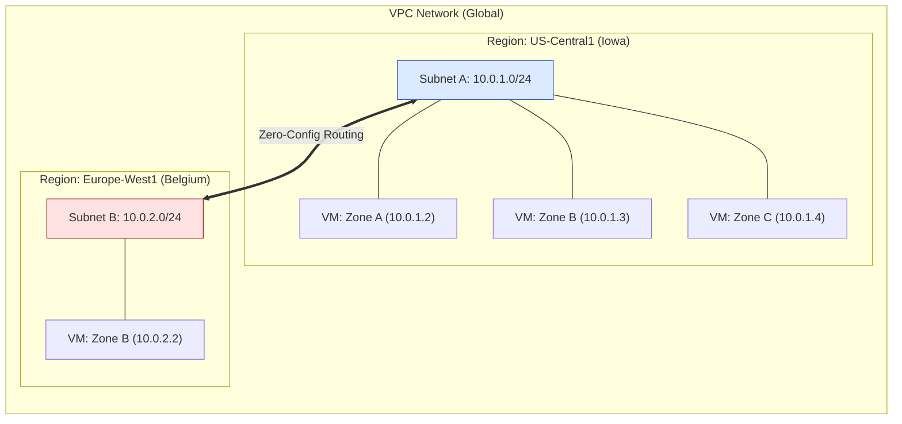

# SECTION 8: Subnets & IP Addressing

> **Official Doc Reference**: [Subnets Documentation](https://cloud.google.com/vpc/docs/subnets)

## 1️⃣ Overview: The Regional Container
In GCP, **Subnets** divide your Global VPC into manageable, regional IP ranges.
*   **Regional Scope**: A subnet belongs to **One Region** (e.g., `us-central1`), but it spans **All Zones** (`a, b, c, f`) in that region.
    *   *Contrast:* In AWS, subnets are Zonal. In GCP, they are Regional. This makes HA (High Availability) architectures much simpler.
*   **Flexible Config**: You can expand subnets on the fly.

## 2️⃣ Architecture Diagram (The "Flat" Network)


*   **Key concept:** VM1, VM2, and VM3 are in different buildings (Zones) but share the **same** default gateway and IP range.

## 3️⃣ Lab Mission: "The IP Crisis" 👨‍💻
**Scenario:** You configured a subnet for 256 IPs (`/24`). Your startup exploded, and you now need 500 servers.
**Mission:** Expand the active subnet to support 4,096 IPs (`/20`) without restarting the production database.

### Task 1: Check IP Range
```bash
gcloud compute networks subnets describe us-core --region=us-central1
# Look for: ipCidrRange: 10.0.1.0/24
```

### Task 2: The "Panic" Expansion (Zero Downtime)
```bash
gcloud compute networks subnets expand-ip-range us-core \
    --region=us-central1 \
    --prefix-length=20
```
*   **Result:** Range becomes `10.0.1.0/20`.
*   **Constraint:** You cannot OVERLAP with another existing subnet.
*   **Constraint:** You cannot SHRINK a subnet.

## 4️⃣ CIDR Cheatsheet (Memorize This)
The "Slash" notation dictates how many IPs you get.

| CIDR | Total IPs | Usable IPs | Use Case |
| :--- | :--- | :--- | :--- |
| `/32` | 1 | 1 | Single Host / Firewall Source |
| `/29` | 8 | 4 | Tiny Interconnect Link |
| **`/24`** | **256** | **252** | **Standard Subnet (Default)** |
| `/21` | 2,048 | 2,044 | GKE Cluster (Small) |
| `/20` | 4,096 | 4,092 | Large Enterprise App |
| `/16` | 65,536 | 65,532 | Entire Region |

> **Note:** GCP reserves 4 IPs in every subnet (Network, Gateway, Broadcast, Reserved). A `/24` gives you 252 usable addresses.

## 5️⃣ Private Google Access (PGA) 💡
**Scenario:** Your VM has **NO Public IP** (for security). It needs to save a file to a Cloud Storage Bucket.
*   *Problem:* Cloud Storage is a public API. The VM can't reach the internet.
*   *Solution:* Enable **Private Google Access** on the **Subnet**.
*   *Result:* The VM accesses Google APIs (`storage.googleapis.com`) using internal private connections.

## 6️⃣ Hands-On: Private Access
```bash
gcloud compute networks subnets update us-core \
    --region=us-central1 \
    --enable-private-ip-google-access
```

## 7️⃣ Checkpoint Questions (Exam Style)
**Q1. You have a subnet `10.0.0.0/24`. You realize you need fewer IPs. Can you change it to `/25`?**
*   A. Yes, use `shrink-ip-range`.
*   B. Yes, if no VMs are running.
*   C. No, you can only expand subnets.
*   D. Yes, via API only.
> **Answer: C.** Subnets can never be shrunk. You must delete and recreate (destroying VMs).

**Q2. Which GCP feature allows a VM with only a private IP to access BigQuery and Cloud Storage?**
*   A. Cloud NAT
*   B. Private Google Access (PGA)
*   C. Cloud VPN
*   D. VPC Peering
> **Answer: B.** PGA is a subnet-level setting for accessing Google APIs privately.

**Q3. In GCP, a single subnet can span:**
*   A. Multiple Regions
*   B. Multiple VPCs
*   C. Multiple Zones within one Region
*   D. The entire globe
> **Answer: C.** Subnets are Regional resources, spanning all zones (a,b,c...) in that region.

**Q4. What is the usable IP count for a standard `/24` subnet in GCP?**
*   A. 256
*   B. 254 (standard networking)
*   C. 252 (GCP specific)
*   D. 250
> **Answer: C.** GCP reserves 4 IPs (Network, Gateway, Reserved, Broadcast). Standard networking usually reserves 2 or 3.


<!-- FLASHCARDS
[
  {
    "term": "CIDR Block",
    "def": "Classless Inter-Domain Routing. Defines IP range (e.g., /24 = 256 IPs)."
  },
  {
    "term": "Static IP",
    "def": "A permanent IP address that doesn't change on reboot."
  },
  {
    "term": "Ephemeral IP",
    "def": "Temporary IP assigned by default. Changes if you stop/start the VM."
  },
  {
    "term": "Private Google Access",
    "def": "Allows private VMs to reach Google APIs (Storage, BigQuery) without internet."
  },
  {
    "term": "Alien Range",
    "def": "IP ranges you can't use (restricted by RFC 1918)."
  }
]
-->
